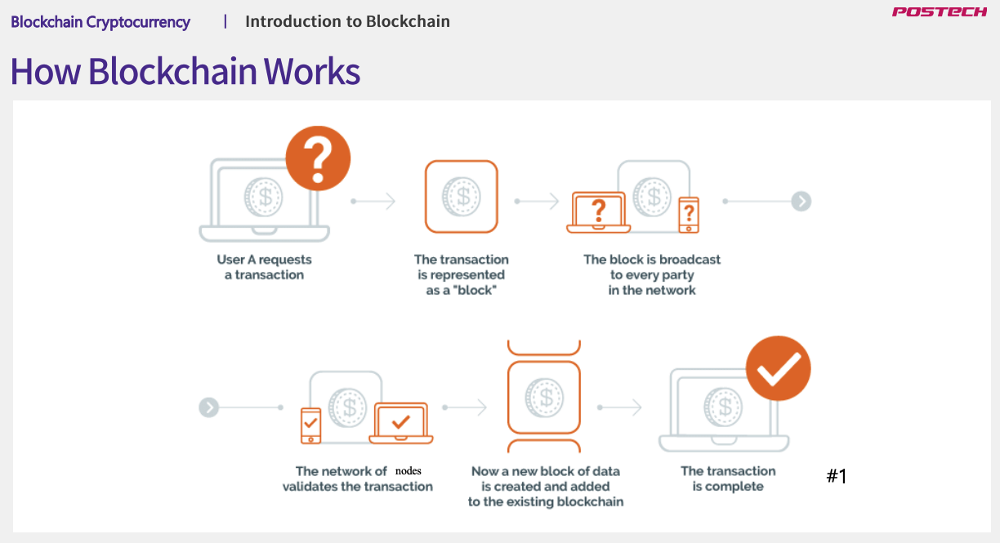
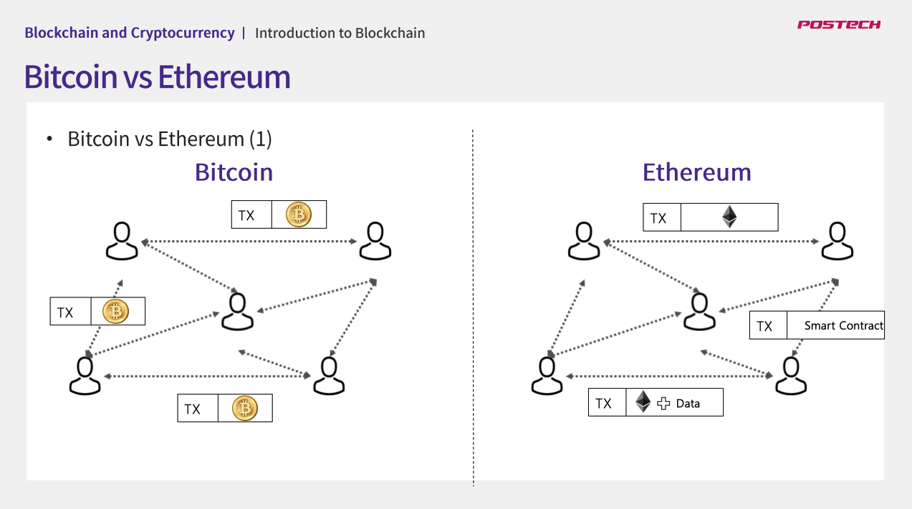
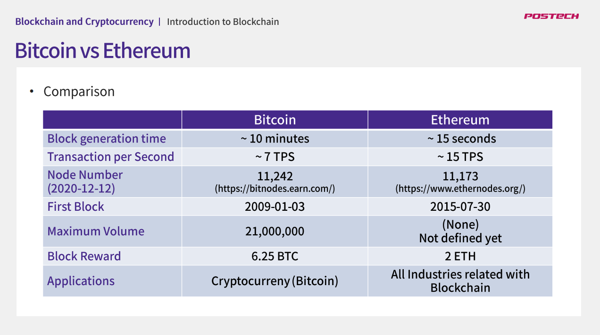
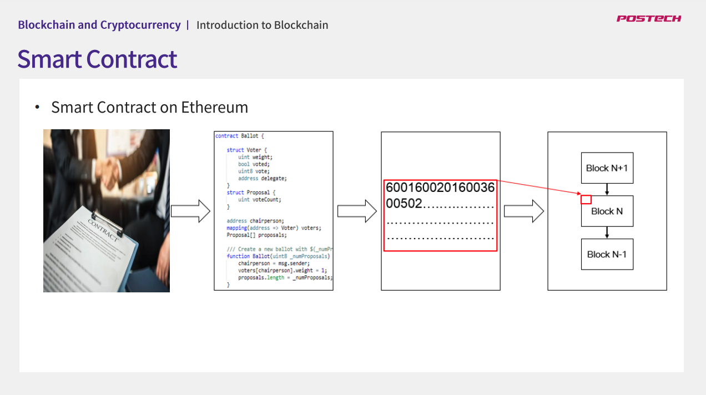
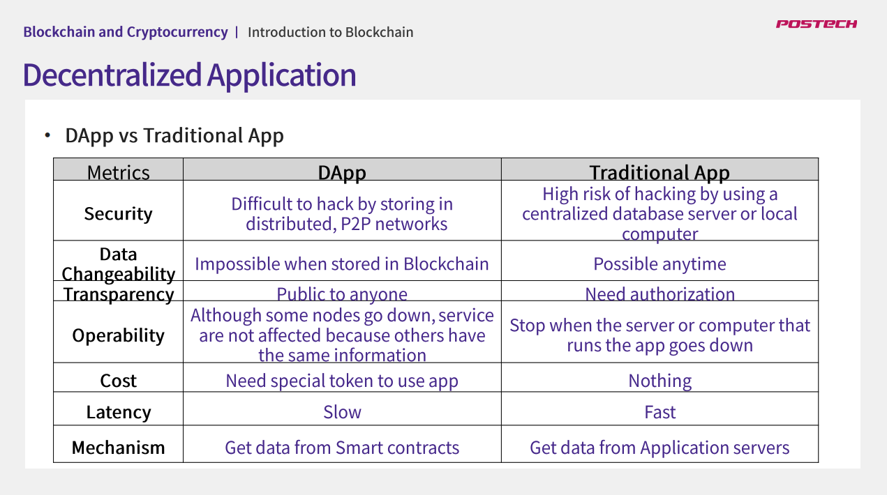
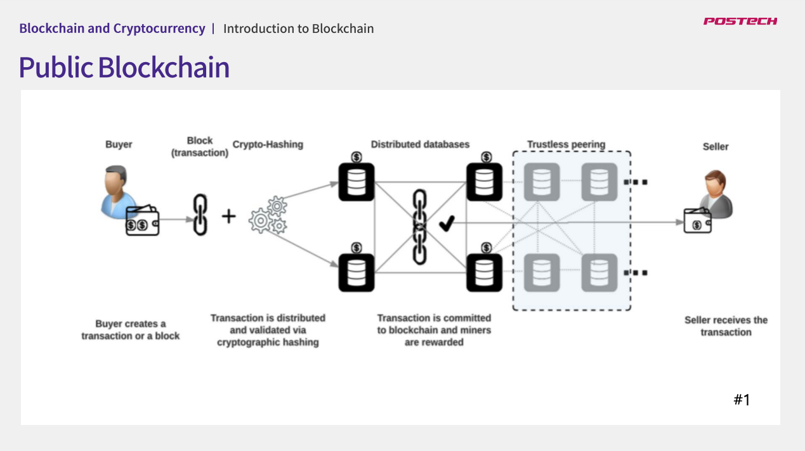
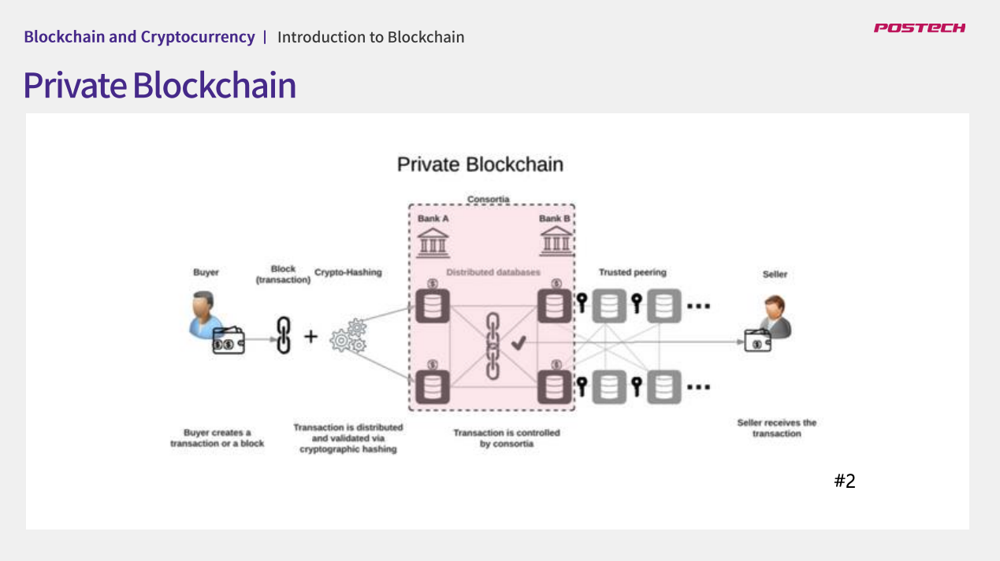
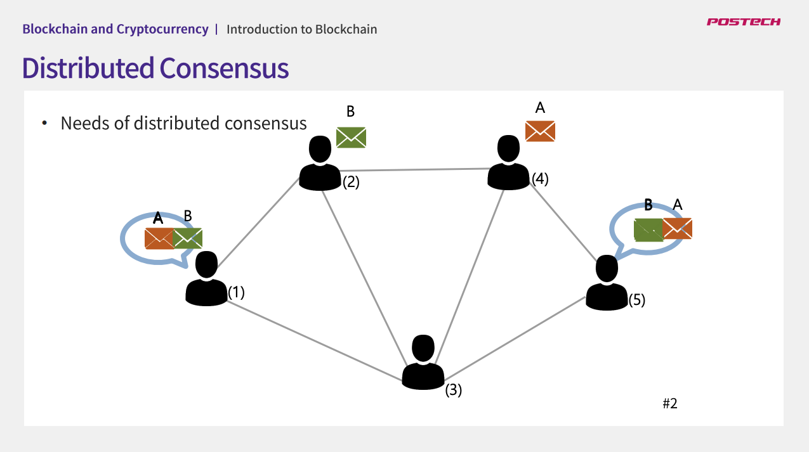

## 강의명 : 블록체인 입문
### 강의 링크 : http://www.kmooc.kr/courses/course-v1:POSTECHk+CSED490U1+2020_1/course/
### 강의에 필요한 자료 : http://www.kmooc.kr/courses/course-v1:POSTECHk+CSED490U1+2020_1/pdfbook/0/

### 01강. 블록체인 기초

#### 블록체인 소개
블록체인은 관리 대상 데이터를 '블록'이라고 하는 자료구조에 저장하여 체인의 형태를 이룬것으로, 데이터를 분산데이터 환경에 저장함으로써 누구라도 임의로 수정할 
수 없고 누구나 변경의 결과를 열람할 수 있도록하는 분산컴퓨팅 기반의 원장관리 기술. 모든 거래를 블록과 체인 형태로 저장하고 있기에 블록체인이라 부름
* 용어설명
  * 분산원장 : 모든 거래 참여자가 거래 장부를 각각 소유하고 이를 분산하여 갖고 있는 것
  * Peer-to-Peer : 제 3자가 포함되지 않은 채 거래 당사자끼리만 통신하는 것
  
#### 블록체인 네트워크의 동작 원리 및 특징

* All participants have the same copy of data
* Anyone can participate in Blockchain
* Block is broadcast to everyone
* Everyone validates the transaction
* Transaction is confirmed and added to blockchain

#### 블록체인 응용분야 및 사례
* JP Morgan : Quorum이라는 자체 블록체인 개발 (기존 블록체인의 문제점을 해결하고자 함)
* Cryptokitties : 이더리움 블록체인 게임. 레크리에이션과 레저를 위해 블록체인 기술을 배포하는 가장 빠른 시도중 하나
* Everledger : 다이아몬드와 그 소유자 정보, 감정서 등을 블록체인으로 관리하는 서비스 제공 (다이아몬드 외에도 고가 보석, 예술품, 와인 등도 관리)
* Slock : 블록체인 기반 집 임대 서비스 제공. 사용자가 블록체인을 통해 임대료의 2배의 금액을 보증금으로 제출한 다음 스마트폰을 이용해서 현관 문을 열고 집안의 다양한 서비스 이용, 
그리고 이용이 끝나면 블록체인의 계약 내용과 비교하여 남은 금액을 정산해주는 서비스
* Gitcoin : 오픈소스의 문제를 공유하고 해결 시 포상금을 지불하는 플랫폼
* Health Nexus : 헬스케어에 특화된 지불, 데이터 유동성, 저장을 관리하는 블록체인 시스템

### 02강-1. 비트코인

#### 비트코인의 특징 (Decentralization, Anonymity, Transparency, Rapidity, Immutability)
* Cryptocurrency
  * **No credit-guaranteed authority required**
  * **Eliminate/minimize transaction fees**
  * **Reduction in overseas remittance fees**
  * **Reduce the cost associated with production / storage**

* 기존화폐와 대비하여 비트코인이 가지는 특징
  * **Issue principal does not exist** : 비트코인의 경우 어느 국가나 정부, 또는 중앙은행이나 기관 등 누구도 비트코인의 발행에 관여하지 않음
  * **Total issued quantity is fixed** : 총 발행량이 정해져 있음. 일정한 주기에 따라 발행량이 절반씩 감소하고 있음
  * **Bitcoin value fluctuates** : 가치가 변동됨
  * **Anonymity guaranteed** : 익명성 보장. 비트코인을 거래할 때 활용하는 비트코인 주소에는 사용자에 대한 정보가 포함되지 않기 때문에 누가 그 주소를 사용하는지를 알아낼 수 없음
  * **Out of physical limitations** : 비트코인은 사용자 개인이 은행으로서의 역할을 할 수 있음. 블록체인에 모든 데이터가 저장되어 있고, 사용자 개인은 모두 그 블록체인을 소유하고 있음
  국가나 사용하는 통화의 제약이 없이 비트코인 네트워크에만 연결할 수 있다면 언제든, 어디서든 비트코인을 이용할 수가 있습니다

* Electronic payment system
  * **System of trading direct electronic currency between participants** : 비트코인 시스템을 사용하는 모든 사람들은 온라인 상으로 직접 전자화폐 거래를 할 수 있음
  * **Absence of central organization** : 은행 지불 수수료 없음. 신용 거래시 발생하는 신용카드 수수료 등도 낼 필요가 없음
  * **Anyone can receive and view transaction information** : 전세계에서 발행된 모든 거래를 확인할 수 있음
  * **Provide strong security** : 거래내역 조작, 단일 사용자 계정 해킹으로 부터 안전
  * **Transparent currency generation** : 사전에 정의되어 있는 룰에 따라 화폐가 발행됨
  * **Anyone can participate in the issue of currency** : 누구나 화폐 발행 과정에 참여하여 이득을 얻을 수 있음

비트코인을 단순히 투자의 대상으로 볼게 아니라, 전 세계에서 적용 가능한, 전 세계를 아우르는 지불 시스템으로서의 역할을 이해하는 것이 중요

* 비트코인의 익명성
  * 비트코인은 월렛이 개인과 연계되어 있지 않기 떄문에 누가 무엇을 하는지에 대해 전혀 알지 못함
  * 비트코인은 거래시 비트코인 송신자나 수신자에 대한 인증과정이 별도로 필요 없으며 누구도 거래시 어떠한 개인정보도 제공할 필요가 없음
  * 거래시 사용하는 비트코인 주소도 자유롭게 생성하고 폐기하는 것이 가능하여 거래에 참여한 유저에 대해 추척하는 것이 상당히 어려움

* 비트코인의 투명성
  * 모든 비트코인 거래는 블록체인 상에 기록됨
  * 비트코인은 모든 거래 기록을 블록체인에 저장하고 누구나 원하는 사람들을 볼 수 있게 투명성을 제공하게 됨
  * 이론적으로는 자신의 월렛 주소가 남들도 볼 수 있게 공개되어 있다면 누구든지 약간의 노력만 기울이면 내가 얼마의 BTC를 보유하고 있는지 쉽게 알 수 있음
  * 그러나 개인과 연계된 특정 비트코인 주소를 추적하는 일은 거의 불가능
    * 자신의 거래 내역을 남들에게 보이길 원치 않는 사람들은 철저하게 익명성을 유지할 수 있음
    * VPN이나 거래를 복잡하게 만드는 믹싱 서비스를 활용하면 됨

* 비트코인의 실시간성
  * 거의 실시간 거래를 함

* 비트코인의 불변성
  * 블록체인은 데이터를 저장하고 추가하는 것만 가능. 저장된 데이터를 삭제하는 기능은 없음

#### 비트코인의 채굴

* what is mining?
  1. **Generate block**
  2. **Generate bitcoin**

Nonce를 증가시키며 hash 함수를 통과시켜, 생성된 hash 값이 블록생성 조건을 만족시키면(이때 블록생성 조건을 만족시키는게 일종의 퍼즐풀기라고 한다면 퍼즐의 난이도로 블록 생성을 통제함. 
ex. 퍼즐을 대략 10분정도에 풀수 있게 설정하여 블록 생성주기를 10분으로 통제) 
블록을 생성할 수 있는 권한을 획득할 수 있게 되고, 이에 따른 보상으로 블록 채굴자에게 비트코인을 지급함.
블록 채굴에 대한 보상은 시기에 따라 다르며 이는 반감기 때문이다. 보통 21만개의 블록이 새로 생성될 때마다 새롭게 생성되는 비트코인의 양이 절반으로 줄어든다. 
이때 2140년 경이 되면 새로 발행되는 비트코인이 없을것으로 예상되는데 (총 발행량이 2100만개로 정해져 있음), 그렇다면 채굴자들이 블록을 채굴할 인센티브가 사라지는것일까? 아니다.
이때 2번째 인센티브가 등장하는데 그것이 '이체수수료'이다. 블록체인에서 송금거래를 할때, 10BTC를 상대방에게 보낸다고 치면, 10BTC 덩어리를 이용하여 상대방에게 3BTC를 보내고, 나머지 7BTC는
자기 자신에게 다시 전송해야 한다. 그렇지 않을 경우 7BTC가 모두 이체 수수료로 쓰이게 되기 때문인다. 이때 발생하는 이체수수료가 블록을 채굴한 채굴자에게 전달되는 두번째 보상이다.
즉, "**이체수수료 = 송신자가 보낸 비트코인의 총량 - 수신자가 받은 비트코인의 총량**" (The higher the transfer fee, the faster it is included in the block)이다. 
이체 수수료는 송신자가 비트코인을 전송할 때, 얼마를 상대에게 보내고 얼마를 자신이 되돌려 받을지를 명시해줌으로써 얼마의 이체 수수료를 지불할지를 결정할 수 있음. 따라서 누군가에게 비트코인을 전송하려고 
할 때에는 상대에게 보낼 비트코인의 양과 이체를 위해 사용할 수수료를 제외한 나머지 금액을 자신의 주소로 되돌려 보내는 것이 일반적.
보통 이체 수수료가 높을수록 채굴자가 받는 보상이 높기 때문에, 채굴자 들은 이체 수수료가 높은 거래를 선택해 블록 생성을 시도하려는 경우가 많음. 즉, 이체 수수료가 많을수록, 자신이 생성한 거래가 블록체인에 더
빨리 저장될 수 있는 것. 비트코인이 모두 발행된 2140년경에는 새로운 블록을 채굴함으로써 얻는 첫번째 보상이 없기 떄문에, 두번째 보상에 해당하는 이체 수수료가 높아질 것으로 예측.

#### 비트코인의 한계
* **Latency**1
  * **Block Generation Cycle 10 Minutes** : 발생한 거래는 블록에 포함되어 블록체인에 연결되어야 완료되기 떄문에, 거래가 완료되기까지 최소 10분을 대기해야 한다는 특징. 
  * **Transaction completion cannot be verified immediately** 
  * **Time included in the block varies depending on transfer fee** : 이체 수수료에 따라 더 길어질 수 있기 때문에 거래의 완료를 바로 확인할 수 없다는 단점이 있음. 실제로 이체 수수료를
아주 낮게 설정한다면 며칠이 걸릴수도 있고, 아주 오랫동안 블록에 포함되지 않을수도 있음
* **Scalability Problem** : 비트코인의 초당 거래량은 초당 약 7개 정도로 매우 적은데, 이 값은 Visa 신용카드의 초당 거래량이 4천개 정도인 것과 비교하면 굉장히 느림
* **Computing Resource Problem** : 수학 문제를 푸는 과정에서 발생하는 에너지 소모량이 엄청나게 많음. 블록 체굴을 위해 소모되는 전력량이 아르헨티나의 전력 소모량이 비슷하다는 보고서도 있음
* **Lack of Smart Contract Functions**
  * **Designed for Cryptocurrency trading** : 화폐로서의 역할에 집중하도록 고안되었기 떄문에 아주 간단한 계약 외에는 스마트 컨트랙트를 적용할 수가 없음.
  * **Constraints exist for use in many industries**

### 02강-2. 이더리움

블록체인의 한계를 극복하기 위해 탄생한 2세대 블록체인

1세대 블록체인들은 화폐의 저장수단으로만 블록체인을 이용함. 반면 이더리움은 화폐 거래 기록뿐 아니라 계약서 등의 추가 정보와 프로세스를 기록할 수 있다는 점에 착안하여, 전 세계 수많은
사용자들이 보유하고 있는 컴퓨팅 자원을 활용해 분산 네트워크를 구성하고, 이 플랫폼을 이용하여 SNS, 이메일, 전자투표 등 다양한 정보를 기록하는 시스템을 창안. 이더리움은 비트코인의 블록체인
기술을 기반으로 설계되었으며, 정확히 프로그래밍 한대로 동작하는 스마트 계약을 실행시키는 분산 컴퓨팅 플랫폼으로 탄생함

이더리움도 블록체인을 참조하여 설계된 블록체인 기반 플랫폼이기 때문에 기본적인 매커니즘은 비트코인과 많이 비슷함. 하지만 "Smart Contract" 기능의 유무와 같음 차이가 있음.

비트코인 플랫폼에서는 스마트 계약이 블록체인에 저장되지 않고, 참가자들이 만들어내는 거래에는 BTC를 보내고 받는 내용만 있음. 반면 이더리움에는 블록체인에 암호화폐인 이더(ETH) 뿐만 아니라
'스마트 계약'도 저장될 수 있음. 그래서 오른쪽 그림을 보면 참가자들이 만들어내는 거래(트랜잭션)에 암호화폐인 이더(ETH) 뿐만 아니라 스마트 계약 정보와 스마트 계약을 이용하기 위한 데이터 등
다양한 정보들이 포함되어 전달됨. 그래서 비트코인 플랫폼에서는 BTC를 '사용했다 or 안했다' 두가지의 상태만 표현할 수 있지만, 이더리움에서는 스마트 계약을 통해서 여러가지 상태를 만들어 낼 수 있음(
"거래중", "입금확인", "거래완료" 등등). 이런 차이를 만들어내는 근본적인 이유는 비트코인 시스템은 블록에 암호화폐에 관련된 데이터만 저장할 수 있다면, 이더리움은 블록에 데이터 뿐만 아니라
비트코인 시스템의 한계인 조건문(if), 반복구문(loop) 등의 실행코드를 포함시켜 로직의 실행을 자동화 할 수 있기 때문. 

비트코인의 경우 계정기반 설계가 아니라서, 사용자는 단순히 비트코인 주소만 가지고 있고, 사용자에 대한 어떠한 정보도 블록체인에 저장되지 않음. 그래서 비트코인 지갑에서 사용자의 잔액을 보여주는 것은 
실제 그 정보가 저장되어 있는것이 아니라, 지갑 SW가 블록체인에 저장된 사용자가 사용할 수 있는 덩어리들을 모두 합하여 보여주는 것. 반면 이더리움은 계정 기반으로 설계됨. 그래서 이더리움에는 그 
계정과 관련된 정보들이 블록체인에 저장되는데, 예를 들어서 실제 해당 계정이 얼만큼 이더를 가지고 있는지도 저장됨. 또한, A가 B로 3ETH를 보낸다면, 비트코인처럼 덩어리로 쪼개서 보내는 것이 아니라,
이더리음 계정안에 있는 잔액 상태를 직접 변경하며 보내게 됨. 이것이 우리가 일반적으로 알고 있는 거래 개념이기 때문에 이해가 더 쉬움. 

아래의 표는 강의일을 기준으로 블록체인과 이더리움의 특징을 추가적으로 비교한 표.

스마트 컨트랙트 (Smart Contract) : 디지털 방식으로 특정한 계약을 수립, 검증, 실행하기 위한 컴퓨터 프로토콜. 제 3자 없이 신뢰할 수 있는 거래의 수행을 가능하게 하며, 거래들은
추적할 수 있고 되돌릴 수 없게 합니다. ("신뢰할 수 없는 인터넷 환경에서 고도로 발달된 계약을 준수하도록 강제하는 프로토콜" - Nick Szabo)
* 스마트 컨트랙트는 기존의 계약관련 법률보다 우수한 보안성을 제공하고 동시에 저렴한 비용으로 계약을 처리할 수 있게함
* 스마트 컨트랙트는 디지털 명령어로 계약을 작성하면 조건에 따라 계약 내용을 자동으로 실행할 수 있음
* 또한 디지털로 된 계약서는 조건에 따른 계약 결과가 명확하고, 계약 내용을 즉각 이행할 수 있다는 장점이 있음
* 블록체인과 결합하여 제 3자의 필요성을 제거할 수 있음

이더리움에서의 스마트 컨트랙트 : 예를 들어 일상에서 볼 수 있는 "동업 계약서"가 있다면, 이의 로직을 프로그래밍을 통해 프로그램화 함. 이때 이더리움에서는 Solidity(솔리디티)라는 스마트 계약 
작성 프로그래밍 언어를 사용하여 작성. 이후 계약서 내용이 작성된 소스코드를 이더리움 컴퓨터가 이해할 수 있는 코드로 변환한 후 블록체인에 저장. 여기까지 완료되면 "동업 스마트 계약"이 블록체인에 저장된 것
이후에는 작성한 계약서 소스코드 내용에 따라서 요청을 받아들이고 정해진 결과를 도출하게 됨. 만약 계약서에 "3개월 이내에 동업자 중 아무나 동업 중지 메시지를 보내면 자동으로 계약이 해지 됩니다."라는 조항이 있다면,
동업자 중 누군가 스마트 계약이 블록체인에 저장되고 2개월쯤 지났을 때 '동업중지' 메시지를 저장된 스마트 계약에 보내게 되면 동업은 자동으로 파기되는 것.

하지만 스마트 계약도 완벽하지 않음. 스마트 계약을 작성하는 것음 사람. 코드를 작성할 때 논리적인 결함이 있을 수 있음. 코드를 작성하는 사람은 이러한 문제를 곧바로 파악하기 쉽지 않음.
이러한 문제 때문에 스마트 계약이 의도지 않게 해킹 되어서 오작동 하는 사례들이 많이 발생하고 있음. EX) DAO 해킹 (탈 중앙화 자율 조직의 대표격인 DAO의 스마트 계약 코드에 취약점이 존재했었고, 해커가 이를
발견해서 해당 취약점을 통해 공격 시도. 해당 공격은 성공적으로 수행되었고 2016년 6월 17일에 총 243만 이더가 해킹 당하게 됨). 그렇기에 코드를 작성할 때 매우 신중해야 함

DApp (Decentralized Application) : 탈 중앙화된 애플리케이션. 블록체인 위에서 동작하면서 중앙 서버 없이 정보를 분산하여 저장하고 블록체인에 저장된 스마트 계약을 통해서 서비스를 제공.

CF) 디앱의 서비스를 사용자가 이용하기 위해서는 일종의 메시지를 생성하기 위해서 비용(수수료)이 요구되며 보통 이것은 코인이나 토큰으로 지불됨. 반면에 전통적인 앱에서는 사용자가 서비스를 이용하는 것 자체는 무료로 비용이 들지 않음. 그리고
디앱은 블록체인마다 속도에 차이가 있지만 보통 전통적인 앱보다 비교적 느림
* DApp의 현황을 볼 수 있는 사이트 : https://www.stateoftheDApps.com
* DApp예시
  * Blockchain Cuties : Crypto game
  * ForkDelta : Ethereum Token Exchange
  * Stox : 이더리움 기반 예측 시장 플랫폼

### 03강. 블록체인의 종류

#### Public blockchain
* 퍼블릭 블록체인은 개방형 블록체인으로 인터넷과 같이 누구나 참여할 수 있음
  * 누군가의 동의나 승인이 없더라도 누구든지 인터넷에 연결된 PC, 노트북, 서버등의 다양한 컴퓨터 장비를 이용해 블록체인 네트워크에 참여할 수 있음
* 자신의 컴퓨터를 블록체인 네트워크에 연결하지 않고, 접속을 차단함으로써 언제든 자유롭게 탈퇴 가능
* 참여와 탈퇴를 전적으로 본인의 의사에 따라 결정 가능
* 퍼블릭 블록체인에 저장되는 모든 트랜젝션 기록들을 참여자들은 볼 수 있음
* 퍼블릭 블록체인의 참여자들은 블록을 생성하는데 드는 노력을 암호화폐를 통해 보상받을 수 있음 (아무런 보상이 없다면 자신의 비용과 노력을 들여 블록체인에 기여하려는 사람이 적어질 수 있음)
  * 퍼블릭 블록체인에서 암호화폐를 발행하는 것은 블록체인 네트워크를 유지하기 위한 필수 사항.

EX) 비트코인, 이더리움, 비트코인 캐시, EOS, 스팀, 모네로 등

#### Private blockchain
* 제한된 노드들만 참여할 수 있는 폐쇠형 블록체인
* 프라이빗 블록체인에 참여하기 위해서는 반드시 관계자의 승인을 얻어야 함. 운영자의 승인을 받지 못한 조직이나 개인은 해당 네트워크에 참여하는 것이 불가능
* 프라이빗 블록체인에 저장된 트렌잭션 기록들은 승인을 받고 참여하는 자들만 볼 수 있음
* 프라이빗 블록체인은 참여에 제한이 있고, 목적성에 따라 내부적으로 운영되는 경우가 많기 떄문에 굳이 네트워크를 유지하기 위한 보상을 제공할 필요가 없음. 따라서 굳이 암호화폐가 필요하지 않기 때문에 화폐를 발행하는 것이 필수 요소가 아님
* 암호화폐의 발행 자체는 가능하지만 암호화폐 거래소를 통해 판매하는 것이 어려워, 사실상 내부에서만 제한적으로 사용될 수 있음
  
* EX) 하이퍼레저 패브릭, Quorum, R3, Nexledger(SamsungSDS), 포스레져(포스코ICT) 등

#### EOS

EOS도 이더리움과 같이 DApp 구동에 특화된 플랫폼. 

| 항목 | 이더리움 | EOS |
|:--------|:-------:|:--------:|
| DApp 개발에 사용되는 언어 | 솔리디티 | C, C++ |
| 블록생성 주기 | 약 10초 | 약 0.5초 |
| 트랜잭션 처리 속도 | 초당 약 15개 | 초당 약 4000개  |
| 합의 알고리즘 | PoW | DPoS |
| 거래 수수료 | gas | 없음 |
| 거버넌스 | 오프체인(Off-chain) | 온체인(On-chain) |

* EOS의 처리 속도와 관련하여 : 싱글스레드에서 1초에 만개의 처리를, 병렬 처리시에는 100만개의 거래를 처리할 수 있도록 하는 데에 목표를 두고 있음
* DPoS : 일종의 간접 민주제, 전체를 대표하는 21명의 참여자를 선출하고, 그렇게 선출된 21명의 투표를 통해 블록을 생성. 빠르게 결정을 내릴 수 있어, 속도 측면에서 상당한 효과
* 거래 수수료와 관련하여
  * 이더리움을 기반으로 만들어진 DApp을 사용하기 위해서는 우선 거래소 등을 통해 이더를 구매해야 함. 그리고 이더가 모두 떨어지면 수수료를 내기 위해 또 이더를 구매해야 함
  * EOS의 경우 사용자에게 사용료를 받지 않음. 사용자가 내야 하는 수수료를 없애는 대신, DApp이 운영에 필요한 EOS를 보유하도록 되어 있음. 가령, EOS 블록체인 성능의 1%를 내가 개발한
  DApp이 사용하도록 하고 싶다면, 전체 발행된 EOS량 중 1%를 가지고 있어야 함. 다시 말해 1%의 EOS를 보유하고 있다는 것은, EOS 블록체인 거래처리량 중 1%를 해당 DApp을 위해 사용하겠다는 것과
  같은 말. 따라서 개발자가 목표로 하는 대역폭이나 네트워크 가용량에 해당하는 EOS를 보유하고 있다면, 그에 비례하는 만큼의 네트워크 용량이 계속 유지되는 것

EOS는 온체인 거버넌스(시스템을 사용하는 사람들의 이해관계를 위해 규칙들을 정하는 것)를 채택. 온체인 거버넌스는 이러한 블록체인 정책을 결정하는 주체가 블록체인 내부에 존재한다는 것을 의미.
선출된 21명의 대표자가 EOS의 정책과 방향성에 대해 토의하고, 결정을 하게 됨. 한편 오프체인 거버넌스는 포럼을 운영하는 형태로 블록체인 밖에서 논의가 이루어진 후, 그 결과가 블록체인에 반영되는 방식

#### Hyperledger Fabric

* 하이퍼레저 : 리눅스 재단 주관하에 2015년 12월에 시작된 블록체인 오픈소스 프로젝트
  * 주요 특징
    * 프라이빗 블록체인 : 기업 별도의 비즈니스 모델을 구현하기에 적합한 환경을 제공함
    * 금융산업에 특화된 다른 플랫폼들과 달리 여러 산업에 범용적으로 도입 가능한 기술 표준을 제공한다는 점
  * 총 16개의 오픈 소스 프로젝트로 구성되어 있 (분산장부, 라이브러리, 툴 등)

* 하이퍼레저 패브릭 : 하이퍼레저의 대표적인, 16개의 프로젝트 중 가장 활발하게 개발되고 있는 프로젝트. 
  * 프라이빗 블록체인
    * 기업용으로 개발됨
    * 신원이 확인된 참가자만 네트워크에 참여가능. 네트워크에 참여할 수 있는 참여자들을 관리하기 위해 멤버십 관리를 담당하는 모듈이 존재
    * Membership Service Provider(MSP)는 네트워크에 참여하려는 사용자가 등록된 사용자인지 아닌지를 확인한 후, 권한이 부여된 참여자만 접근할 수 있도록 함
    * 따라서 블록체인 네트워크 상에서 벌어지는 일에 대해 참여자에게 책임을 물거나 부인을 방지할 수 있음
    * 허가된 사용자들이 각자 특정 목적을 가지고 블록체인 네트워크를 유지하므로 보상을 제공할 필요가 없음
  * 합의 알고리즘 및 회원 서비스와 같은 구성요소를 플러그 앤 플레이 방식으로 지원
    * 개발자가 원하는 방식의 합의 알고리즘을 선택해서 사용할 수 있음
    * 비트코인, 이더리움 등에서는 합의의 의미가 블록을 생성할 권한을 누구에게 줄 것이냐를 의미했다면
    * 하이퍼레저 패브릭에서의 합의는 거래 생성부터, 그 거래가 포함된 블록이 참여자에게 저장되기까지의 모든 과정을 합의라고 말함. SOLO, Kafka 등의 합의 알고리즘이 있음
  * 체인코드(Chaincode)
    * 하이퍼레저 패브릭의 스마트 컨트랙트 프로그램
    * 이더리움의 스마트 컨트랙트와 유사하지만, 개발 언어로 솔리디티를 사용하는 이더리움과 달리 체인코드는 Go, Node.js와 같은 기존의 언어들을 이용해 개발 할 수 있음
    * 분산 원장에 데이터를 기록하거나, 데이터를 읽어오기 위해 체인코드가 필요. 체인코드 그 자체로도 사용될 수 있지만, 주로 비즈니스 모델에 맞는 DApp과 함께 개발되어 사용됨
  * 채널개념 도입 : 블록체인 참여자들간의 프라이버시를 강화할 수 있게 함
    * 전체 시스템을 다수의 채널로 구분하여 multi-blockchain으로 운영할 수 있음. 전체 시스템을 다수의 채널로 구분하고, 채널 별로 독립적인 블록체인을 유지할 수 있음
    * 참여자는 특정 채널에 가입함으로써 블록체인을 선택할 수 있고, 다수의 채널에 가입하는 것도 가능
  * 거래의 병렬 처리
    * 하이퍼레저 패브릭은 거래들을 병렬적으로 처리함으로써 처리 성능을 높일 수 있음. 초당 만개 이상의 거래를 처리하는 걸 목표로 하고 있음.
    * 이더리움은 일정 시간이 경과해야 생성된 거래가 메인 체인에 포함되었음을 확인할 수 있는 반면, 패브릭에서의 거래는 블록이 만들어지는 즉시 승인

#### ICON

자체 개발 고성능 블록체인 엔진으로 구성된 엔터프라이즈 블록체인 솔루션. On-Premise, Public Cloud, 기업의 Private Cloud와 같은 다양한 비즈니스 환경 최적화와 동시에
분산원장 관리, 자동 배포, 통합 환경설정, 네트워크와 데이터 모니터링, 장애 보기 기능 등 다수 기능 지원. 아이콘 루프의 경우 지난 2019년 GS인증 1등급 획득과 더불어 블록체인 
업계 최초로 '대한민국 SW제품 품질대상 최우수상' 수상

루프체인(Loopchain) : 아이콘 루프가 독자 개발한 프라이빗 블록체인 엔진. 금융거래를 지원하는 것을 목적으로 개발. 추후 사물인터넷 환경 등 블록체인이 적용 가능한 다양한 서비스를 
구성하기 위한 엔진 개발을 목표로 하고 있음.
* 하이퍼레저 패브릭이나 R3 코다에 비해 블록체인의 기본에 더욱 충실한 구조
* 기본 비트코인 블록체인처럼 블록이 연결된 구조를 모두가 합의하는 방식으로 트랜잭션 순서를 정해줌 (하이퍼레저 패브릭의 경우 중앙에 트랜잭션 순서를 정해주는 무언가가 있고, 체인은 이 내용
을 검증해줌)
* R3처럼 인스턴트 네트워크(Instant network)를 추구하는 것이 아닌 이해관계가 있는 노드들이 반 영구적으로 네트워크를 구성하는 블록체인
* 고성능 스마트 컨트랙트 플랫폼인 SCORE를 통해 개발 친화적인 언어로 자유롭게 개발환경을 구성할 수 있게 함
* PBFT와 같이 중개자 없이 당사자간 메시지 전달에 기반한 고성능 합의 알고리즘을 사용함
* 동일한 블록체인 네트워크 안에서 선택한 구성원들 간에 형성되는 독립적인 가상 네트워크를 지원하는 멀티채널 기술을 제공하고 있음

Loopchain SCORE : 합의 엔진과 의존성을 최대한 떨어뜨린 별도의 모듈로 개발됨. 합의 엔진과 SCORE는 내부 gRPC로 구현된 인터페이스를 통하여 통신을 하기 떄문에
인터페이스만 맞으면 어떠한 언어로도 구현이 가능하나 현재는 파이썬 구현체만 허용하고 있음. DB는 자유롭게 사용 가능. 다만 이더리움처럼 변수의 모든 데이터가 저장되지는 않고
DB에 직접 읽고 쓰고 한 결과만 저장됨. 

루프 장애 허용(LFT; Loop Fault Tolerance) 방식은 현재 루프체인에서 사용하는 합의 알고리즘. 루프체인은 플러그인(plug-in) 형태로 합의 알고리즘이 구현되어 
있기 때문에 필요에 따라 PBFT(Practical Byzantine Fault Tolerance)와 같은 다른 합의 알고리즘을 사용할 수 있음. 루프장애 허용 알고리즘은 기존 PBFT
에서 발생하는 통신 오버헤드를 piggy backing(네트워크에서 메시지를 통합하여 통신 오버헤드 감소)을 이용하여 줄임. 또한 리더를 매번 교체하는 Spinning 기법을
이용하여 악의적인 노드가 네트워크의 합의를 해치지 않는 범위에서 네트워크에 문제를 일으킬 수 있는 특정 노드의 트랜잭션 거부 문제, 리더에 의한 네트워크 지연과 같은
문제를 해결함. 기존 알고리즘들이 가지고 있던 지나치게 복잡한 리더 선정 알고리즘을 단순화

### 04강. 합의 알고리즘

#### 분산 합의(Distributed Consensus)

블록체인에서의 합의는 참여자 중 누구에게 블록을 생성할 권한을 주느냐를 결정하는 것. 블록체인 네트워크는 중앙 기관 없이 참여자들끼지 서로 연결되어 있는 구조기 때문에, 결정을 내리기 위해서는
여러 사람들의 의견을 통일하기 위한 방법이 필요함.

성공적인 분산 합의가 이뤄지기 위해 필요한 2가지 요건은 아래와 같음
1. 올바른 참가자들 모두에 의해, 같은 값으로 결정을 내리면서 합의 과정이 끝나야 함
2. 합의의 결과 결정된 값은 임의의 값이 될 수 없고, 적어도 하나의 올바른 참가자에 의해서 제안된 값이어야 함

분산합의가 필요한 이유? : 아래와 같은 상황이 생길 수 있는데, 이 시스템은 둘 중에 어떤 메시지 연결 순서를 받아 들여야 하는지에 대한 의문이 제기될 수 있음. 결국 분산 시스템에서 모두가 동일한
상태를 가지고 있을 수 있도록 하는 것이 '분산 합의 알고리즘'임 (기존의 중앙화 시스템에서는 일치하지 않는 의견을 중앙 기관이 결정했지만, 블록체인과 같은 탈 중앙화 시스템에서는 결정을 내려줄 주체가 없음)

분산 합의 시스템에서 제기될 수 있는 몇가지 기술적인 문제들
* 노드가 제거되거나 악의적일 수 있음
* peer-to-peer 시스템이나 모든 노드가 서로 연결되어 있지 않다면 네트워크는 아주 불완전 함
* 인터넷 연결 상태가 좋지 않으면 통신 실패상태가 될 가능성이 있음
* 모든 데이터를 관리하는 하나의 데이터 센터가 없기 때문에 다양한 통신에서 지연이 발생할 수 있음
  * 네트워크 지연으로 인해 분산합의 시스템에서는 글로벌 시간이라는 개념이 없음
  * 즉, 모든 노드가 단순히 타임스탬프에 근거하여 이벤트의 순서를 합의하는 것이 불가능

분산 합의 알고리즘의 종류
* 작업증명(PoW) : 목표값 이하의 해시를 찾는 과정을 무수히 반복함으로써 해당 작업에 참여했음을 증명하는 방식의 알고리즘.
  * Bitcoin, Bitcoin cash, Ethereum, Ethereum classic, Litecoin, Zcash, Monero 등
* 지분증명(PoS) : 암호화폐를 보유하고 있는 지분율에 비례하여 의사결정 권한을 주는 방식
  * QTUM, Peercoin 등
* 위임증명(DPoS) : 암호화폐 소유자들이 각자의 지분율에 비례하여 투표권을 행사하여 자신의 대표자를 선정하고, 이 대표자들끼리 합의하여 의사결정을 내리는 방식
  * EOS, Steem, Risk, Ark 등
* 비잔틴 장애 허용의 이용 (PBFT) : BFT의 확장형태.
  * Neo, R3, ICT, Tendermint 등
    등이 있음

#### Proof of Work (몇가지 상식적인 설명은 생략)

비트코인 창시자인 사토시 나카모토가 비트코인에 대한 이야기를 담은 논문 (Bitcoin: A Peer-to-Peer Electronic Cash System)에서 처음으로 제안한 비잔틴 합의 알고리즘
(실제 비트코인 블록의 헤더속의 데이터를 보면, Difficulty와 Nonce가 설정되어 있는 것을 확인할 수 있음). 작업증명 알고리즘이 필요한 이유는 모든 노드가 동시에 블록을 만들 수 없게 하는 것임.
작업증명을 통과해야만 블록을 생성할 수 있고, 이를 위해서는 엄청난 에너지가 소모됨. 그리고 작업증명 알고리즘은 Difficulty 조절 알고리즘을 이용하여 약 10분당 1개의 블록이 생성되는 것을 보장함.
동시에 블록이 생성되는 경우, 추후 더 긴 체인을 메인넷으로 설정함(Select Longest chain). 결과적으로 모든 참여자들은 동일한 순서로 연결된 블록체인을 유지하게 됨.
만약 네트워크 전송속도 지연으로 네트워크 체인상에 분기가 발생하게 된다면, 네트워크의 노드들은 다음 블록을 생성하기 위해 역시 가장 긴 체인을 선택함.
이처럼 가장 긴 체인이 네트워크에서 선택되기 때문에, 이러한 분기가 발생할 시, 더 긴 체인을 만들기 위해 경쟁이 일어나게 되는데 이러한 경쟁은 6개의 블록이 생성되지 전에 보통 종료됨(6 confirmation)

* 6 confirmation : 자신이 생성한 거래는 그 거래가 포함된 블록 이후에 5개의 블록이 더 생겨야, 해당 트랜잭션이 완전하게 거래됐다는 것을 의미

작업증명 합의 알고리즘은
* 일시적으로 합의가 깨질 수 있으나, 확률적으로 마지막엔 하나의 블록체인을 합의하게 되는 합의의 알고리즘.
* 글로벌한 규모의 완전히 오픈된 네트워크에서 운영할 수 있는 알고리즘 (기존 합의 알고리즘이 적은 수의 노드와 대다수는 올바른 행동을 한다는 가정을 통해 작동한다는 것과 대비됨. f를 잘못된 노드의 수라고 하였을 때 보통 3f+1 이상이 올바른 일을 해야 정상 운영)
* 느린 속도와, 낭비되는 에너지 문제가 심각함. 강의 시점을 기준으로 비트코인 한 블럭을 생성하기 위해서는 5,000,000 TH/s 이상의 해시 파워가 필요함.

#### Proof of Stake (PoS)

CF) PoW 합의 알고리즘이 일으키는 문제
1. 자원 낭비 문제 : "전세계적으로 비트코인 채굴에 쓰이는 전기의 양이 세르비아 국가 전체가 사용하는 전기의 양을 넘겼음" - 디지코노믹스
2. 컴퓨팅 파워가 큰 채굴자들의 영향력이 커짐 : 컴퓨팅 파워를 많이 가지고 있는 채굴자가 비트코인의 생성에 관여하며 이를 컨트롤 할 수 있게 됨. 
3. 컴퓨팅 파워가 큰 그룹끼리 Mining Pool을 형성한다면 비트코인 네트워크에 매우 큰 영향력을 행사할 수 있음 (51% 공격 문제 : 블록체인 네트워크에서 51%의 컴퓨팅 파워를 점유한다면 해당 네트워크를 control할 수 있게됨)

위와 같은 문제점들을 해결하기 위해 다양한 합의 알고리즘들이 등장함.
* 지분 증명 (Proof of Stake) : 자신이 가지고 있는 암호화폐의 양에 따라서 블록을 생성할 권한을 주겠다는 것
* 위임 지분 증명 (Delegated Proof of Stake) : 지분으로 블록을 생성할 권한을 주지만, 위임된 몇몇의 참여자만 생성할 수 있도록 제한하는 것
* 권위 증명 (Proof of Authority) : 네트워크에서 자신의 평판/기여도에 따라서 블록을 생성할 권한을 부여하는 것

ETC

지분 증명(Proof of Stake)의 경우,
채굴이 일어나지 않아 채굴자가 존재하지 않음. 대신 검증자(Validator)가 존재함. (Miner, Mining 대신 Validators, Minting/Forging이란 용어를 사용함)

지분증명은 크게 아래와 같은 방식을 통해서 수행됨.
1. 블록 생성 및 검증의 역할을 하는 Validator가 되기 위해서는 **자신이 보유하고 있는 암호 화폐를 보증금의 형태로 락업하는 특별한 거래(Special Transaction)** 을 해야 함
2. 그 이후 새로운 블록을 생성하고 검증하는 절차는 모든 Validator가 참여할 수 있도록 하는 **특정 '합의 알고리즘(Consensus Algorithm)'** 에 의해 이뤄짐

이때 중요한 점은 바로 특정 합의 알고리즘이 하나가 아니라는 점임. 여기서의 특정 합의 알고리즘은 지분 증명이라는 큰 틀 안에서 블록 생성 및 검증, 그리고 보상에 관한 알고리즘을 말함. 
따라서 그 방법에 따라 지분증명은 다양한 형태가 될 수 있음(지분 증명의 경우 큰 틀에서 '참여자의 소유 지분이 블록 생성에 영향을 미친다'는 의제를 공유하지만 세부적인 부분에 있어서는 많은 차이를 보임). 
가장 대표적인 형태로 'Chain-Based PoS'와 'BFT-Style PoS' 등이 있음.

CF) [합의 알고리즘](http://wiki.hash.kr/index.php/%ED%95%A9%EC%9D%98_%EC%95%8C%EA%B3%A0%EB%A6%AC%EC%A6%98)

Chain-Based PoS에서는 10초 단위의 매 슬롯마다 다음 블록을 검증하기 위한 1개의 노드가 랜덤하게 선택됨. 하지만 검증자가 완전히 랜덤하게 선택되지는 않음(pseudo-randomly). 
검증자가 되기 위해서는 노드가 네트워크에 일종의 보증금을 지불해야 함. 얼마의 지분을 스테이킹(Staking) 했냐에 따라 검증자가 선택되며, 더 많은 지분을 보유하고 있을수록 검증자로 선택될 확률이 높음(선형 상관관계). 
검증자는 자신이 가진 지분(Stake)에 비례한 확률로 블록을 생성할 권한을 얻게 되고, 블록을 생성한 후에는 자신이 원하는 체인에 블록을 연결하여 그에 대한 보상을 받음(생성된 블록은 반드시 이전 블록 중 하나를 가리켜야 하는데 보편적으로 길이가 가장 긴 체인의 마지막 블록을 가리키게 됨. 
이에 결과적으로 대부분의 블록들은 단일의 체인에 모이게 되며, 지분증명의 가장 기본적인 형태라고 볼 수 있음).

BFT-Style PoS에서는 Validator들에게 완전히 랜덤하게(randomly) 블록을 제안(propose) 할 수 있는 권한이 주어짐. 다만 어떤 블록이 정규 블록인지에 대한 합의는 여러 라운드에 걸쳐 이뤄짐. 
매 라운드 마다 모든 Validator는 특정 블록에 ‘투표’를 할 수 있음. 모든 라운드가 끝나면 Validator는 어떤 블록이 체인의 부분인지 아닌지 영구적으로 합의하게 됨. 
특이한 점이 있다면 길이가 길거나 사이즈가 큰 체인의 블록이 남는 것이 아니라 많은 합의를 받은 단 한 개의 블록만이 남을 수도 있다는 점이 있음.

* 그렇다면 지분을 많이 가지고 있는 사람에게 유리하니 불공정하지 않느냐는 물음에 대하여 : PoW에서는 컴퓨팅 파워가 큰 사람이 '규모의 경제' 효과(ex. 전기를 한번에 많이 살수록 단위전력당 구매비용은 적어짐)를 누릴 수 있지만 PoS에서는 그것이 불가능
* 한편 검증자를 어떻게 신뢰할 수 있느냐는 물음에 대하여 : 이 부분에서 stake가 재등장함. 잘못된 거래를 검증자가 승인하게 되면, 해당 검증자는 stake 만큼을 잃어버림. 
만약 검증자가 얻을 수 있는 거래 수수료보다 많은 stake를 가지고 있다면, 우리는 해당 검증자를 신뢰할 수 있다고 가정함 (stake가 트랜잭션 수수료의 합보다 크다면 이 가정은 유효하다고 생각). 
만약에 node가 검증자가 되는것을 그만한다면, 그의 stake 및 그가 얻을 모든 트랜잭션 수수료를 더하여 일정시간 후 돌려받게 되는데, 일정시간을 둔 이유는 해당 검증자가 잘못된 거래를 승인했을때 처벌할 시간을 벌기 위함이다.   
CF) Nothing-at-Stake 문제가 발생 할 수 있음 : 말 그대로 '잃을 것이 없는 상태' 만약 유효한 블록체인이 2개 이상 존재하는 fork 상황이 발생하면 PoW 방식에서는 블록을 생성하는데 막대한 양의 컴퓨팅 파워와 전기를 소모하기 때문에 하나의 블록을 지정하여 그 다음 블록을 생성하게 되는데, 지분 증명 방식에서는 Validator가 포크된 모든 블록에 지분을 투표할 확률이 높음. 왜냐면 컴퓨팅 파워와 같은 기회 비용이 존재하지 않고 합의 방법에 별다른 제한이 없기 때문에 양쪽 모두에 지분을 증명해 놓아야 보상받을 가능성을 높일 수 있음. 이 때문에 'Slash 제도'가 도입 됨. 만약 검증자가 여러 블록에 지분을 증명하거나 잘못된 블록에 지분을 증명하게 되면 해당 지분은 Slash 즉 사라지게 됨. 이와 같이 Nothing-at-Stake가 아니라 Something-at-Stake 상태를 이용하여 문제를 해결하고 있음

즉, PoS의 경우 자신이 스테이킹한 코인에 대해서 이자를 받는 방식에 비유될 수 있음.

* 지분 증명의 장점
  * 작업 증명처럼 블록 생성을 위해서 컴퓨팅 파워를 소모할 필요가 없음 (에너지 비용 절감)
  * 지분에 비례하여 블록 생성의 권한을 얻기 때문에 중앙화 위험이 비교적 감소함
  * 최종성(Finality)를 부여해 이미 체인에 연결된 블록들이 변경되기 힘들게 만듦
  * 공격자의 악의적인 행동이 발각되면 모든 자산을 0으로 만드는 패널티를 부여해 공격이 일어나지 못하도록 함

* 지분 증명과 관련된 문제점
  * 51% 공격 문제가 PoS에서 나타날 수도 있음. 하지만 51%의 암호화폐를 점유해야 하기 때문에, 코인의 가치를 따져봤을때 그럴 일이 발생할 확률이 많이 줄어듦. 하지만 한편에서는 단순 수학적 계산으로 비교할 수 있는 부분이 아니라고 주장함. 블록체인의 런칭 시기 및 화폐 발행량을 포함한 다양한 요인들로 인하여 51%지분을 확보하는 비용이 천차만별 일수도 있기 때문
  * 검증자 선정이 완전히 랜덤하지는 못함.(Stake가 반영되기 때문. 그렇기에 rich한 node가 더욱 rich해 지는 과정이 반복될 수 있음 -> 이와 같은 문제 해결을 위해 coin age based selection algorithm 등이 고안되고 있음; 코인의 양과 보유일수를 반영하는 것. 대표적인 예가 바로 ‘Peercoin’. 예를 들어 A가 10개의 코인을 10일 동안 보유했다면 100의 가치를 갖게 하는 것. 만약 해당 코인을 사용한다면 100의 가치가 소모되고 처음부터 다시 시작. 이 경우에 보유 코인이 적어도 보유 일수가 길면 블록을 생성할 수 있는 확률이 높아지기 때문에 보다 균등하게 기회가 주어질 수 있음)
  * 다음 검증자를 선택했는데, 해당 검증자가 검증자의 역할을 수행하지 못하는 상태라면? : 만일의 상황을 대비해 백업 검증자를 선발해 대비함
  
| | PoW | PoS |
|:--------|:-------:|:-------:|
| 장점 | 강력한 보안성을 바탕으로 서비스가 남용되는 것을 쉽게 방지 | 친 환경적인 알고리즘. 블록 생산자의 탈 중앙화의 안정성을 확보해주는 장점이 있음 |
| 단점 | 채굴 비용이 크기 때문에 개인 채굴자는 채굴 할 수 없는 수준까지 도달. 채굴자들끼리의 단합에 주의해야 함 | 코인 보유량에 따라 블록을 생성한 보상을 받기 때문에 모든 참여자들이 이자를 받기 위해 코인을 보유하기만 하여 유통량이 감소할 수도 있는 문제가 있음. 검증되지 않은 합의 알고리즘으로 보안성에 대해 확신할 수 없는 단점이 있음 |

지분 증명을 사용하는 대표적인 블록체인 : 퀀텀, 스트라트, 엔엑스디, 아더코인, Ethereum 2.0 등

#### Delegated Proof of Stake (DPoS)

지분 증명이 직접 민주주의라면 위임 지분 증명은 간접 민주주의. 지분 증명은 자산을 가진 사람들이 전부 참여하여 자신의 권리를 직접행사하는 방식. 위임지분증명은 투표를 통해 대표를 선출하고, 선출된 대표자(검증자, Validator)들에게 권한을 위임하는 것. PoS는 많은 사람들이 투표에 참여하기 때문에 블록을 생성하는데 시간이 오래 걸림. DPoS는 지분을 가지고 있는 사람들이 뽑은 소수의 대표들만 투표를 진행하기 때문에, 블록이 빠르게 생성됨.
즉, 위임 지분 증명은 네트워크 상의 검증자 수를 제한하여 높은 수준의 확장성을 제공하는 지분 증명의 변형.

검증자의 수는 위임 지분방식을 채택하는 블록체인마다 차이가 있으며, 예를들어 스팀/이오스에서는 검증자의 수가 21개, 아크는 51개, 리스크는 101개 등으로 다양함.

추가적 참고글 :
1. https://steemit.com/kr/@kblock/44-1-pow-pos

