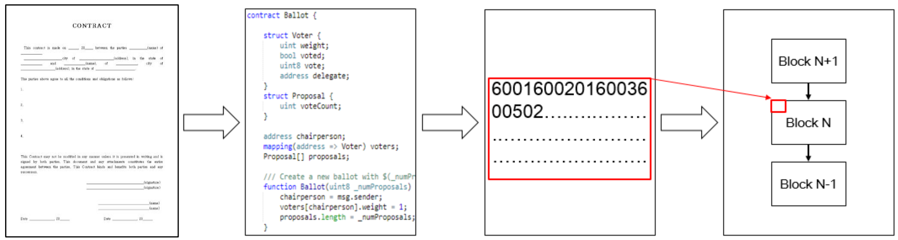
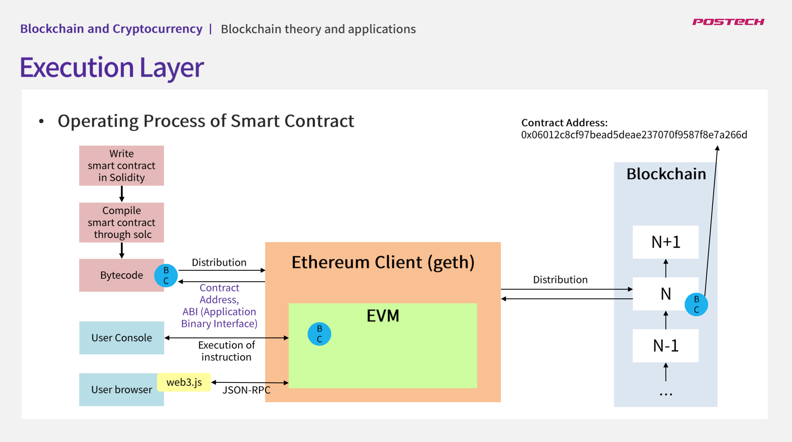
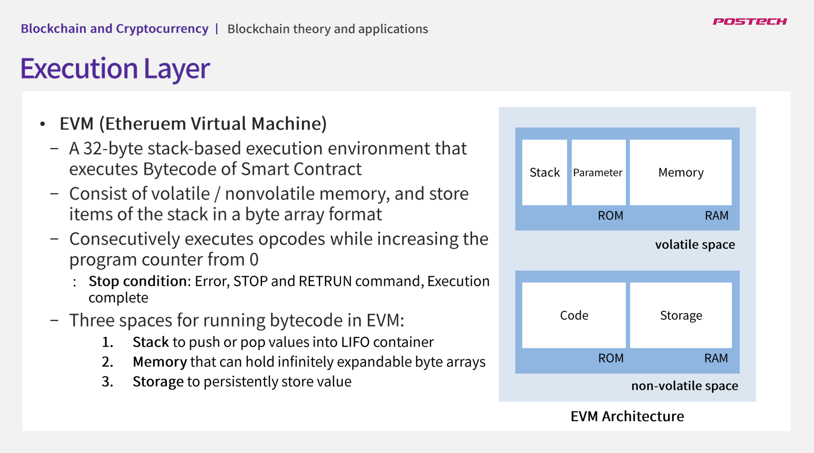
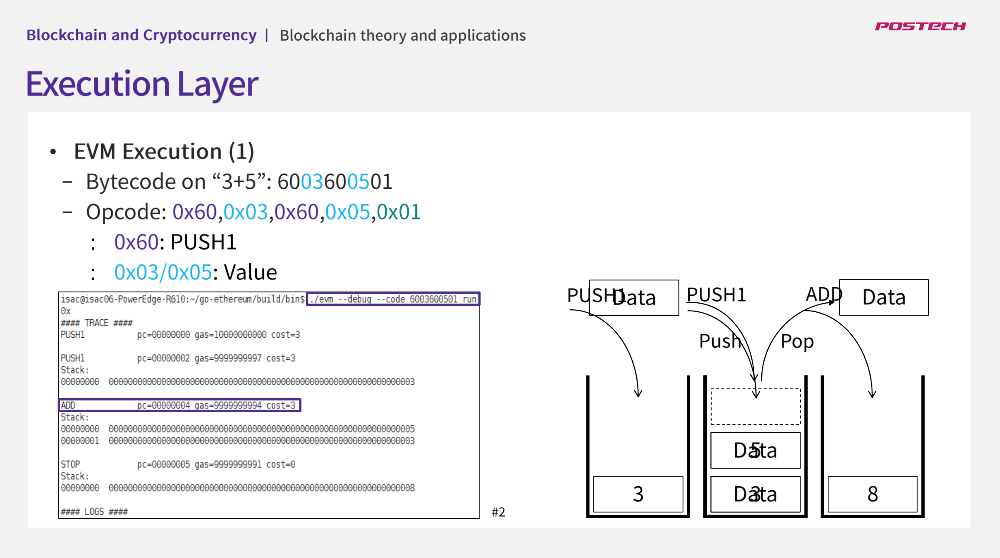
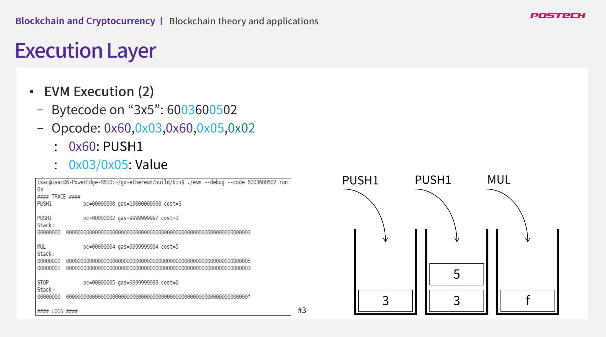

## 강의명 : 블록체인 이론 및 응용
### 강의 링크 : http://www.kmooc.kr/courses/course-v1:POSTECHk+CSED490U2+2021_T2/video
### 강의에 필요한 자료 : http://www.kmooc.kr/courses/course-v1:POSTECHk+CSED490U2+2021_T2/pdfbook/0/

### 06강. Ethereum(2)

#### Execution Layer
이더리움에서는 스마트 컨트랙트 실행을 위한 실행계층이 존재함.

스마트 컨트랙트란? :
* 1994년 Nick Szabo에 의해 처음으로 제안됨 : "신뢰할 수 없는 컴퓨터 인터넷 환경에서 고도로 발달된 계약을 준수하도록 강제하는 프로토콜"
* 디지털 방식으로 특정한 계약을 수립, 검증, 실행하기 위한 컴퓨터 프로토콜. 제 3자 없이 신뢰할 수 있는 거래의 수행을 가능하게 하며, 거래들은 추적할 수 있으나 되돌릴 수 없음
* 기존의 계약 관련 법률보다 우수한 보안성을 제공하고 동시에 저렴한 비용으로 계약을 처리할 수 있게 함
* 디지털 명령어로 계약을 작성하면 조건에 따라 계약내용을 자동으로 실행할 수 있음
* 디지털로 된 계약서는 조건에 따라 계약 결과가 명확하고, 계약 내용을 즉각 이행할 수 있다는 장점이 존재

최초의 블록체인 기반 스마트 컨트랙트는 비트코인 스크립트라는 단순한 실행 프로그램. 비트코인의 트랜잭션에서 Opcode(컴퓨터에서의 연산 종류를 나타내기 위한 코드. 
즉, 덧셈을 ADD, 제곱근을 SQR 등으로 기억에 편리하도록 기호화한 것)로 스크립트를 작성해서 보내면 조건에 따라 자동으로 거래를 수행.
이때 스크립트는 입력값에 들어오는 UTXO(Unspent Transaction Outputs; 미사용 트랜잭션 출력값을 말한다. 미지출 거래 출력이라고도 함)의 소유권을 검증하여 트랜잭션의 유효성을 검사하는 단순한 기능만 지원했음.
스크립트가 정상이면 트랜잭션이 정상이라고 본다는 일종의 계약 개념이 있으므로 Contract Code로 불리기도 함. 하지만 비트코인 스크립트는 반복문을 사용할 수 없고, 
비트코인 잔고 외에 다른 정보를 관리할 수 없는 한계가 있음.

이더리움에서의 스마트 컨트랙트?

이더리움은 닉 자보가 고안한 스마트 컨트랙트의 개념을 채용하여 비트코인의 단순한 스크립트를 더욱 발전시킴. 이 결과 다양한 형태의 응용 컨트랙트를 개발 할 수 있도록 발전했고, 단순 암호화폐 플랫폼을 벗어나 다양한 분야에 적용할 수 있는 블록체인 컴퓨팅 플랫폼으로 발전하게 됨.

이더리움에서 스마트 컨트랙트는 스마트 컨트랙트를 작성할 수 있는 언어(ex. solidity)를 사용해 일종의 논리/응용 프로그램을 작성한 것을 말한다. 
스마트 컨트랙트는 이더리움 어카운트의 상태를 변경할 수 있는 프로그램 코드로서 이더리움 P2P 네트워크 상에 배포되어 블록체인 내에 상태 정보로 존재하고, 이더리움 가상 머신(EVM)에서 작동되어 상태전이를 유발함.
이러한 스마트 컨트랙트는 이더리움에서 새로운 스마트 컨트랙트가 생성되거나, 특정 스마트 컨트랙트의 함수를 실행하거나, 이더를 전송하는 방식 중 하나로 실행됨. 
모든 컨트랙트의 내용과 입력정보는 블록체인에 저장되고 공유되며 이 때문에 악의적으로 컨트랙트를 조작하는 것을 방지할 수 있음.
또한 이더리움은 스마트 컨트랙트를 실행할 때마다 수수료인 가스(Gas)를 발생시키고 네트워크 상에 수수료의 한계를 설정하여 무한루프를 막음.

스마트 컨트랙트를 개발하는 언어로는 솔리디티, 서펀트(Serpent), LLL, Mutan(뮤탄) 등이 있지만, 현재 솔리디티가 가장 많이 사용되고 있음.

스마트 컨트랙트를 진행하는 전반적인 과정은 아래와 같음
1. 실물 계약서의 내용을 솔리디티 등의 언어를 이용하여 스마트 컨트랙트 코드로 작성함 (계약의 작성)
2. 이것을 컴파일 하여, 코드의 byte code를 이더리움 네트워크로 전파시켜 이더리움 블록체인 안에 포함 함 (계약의 시행) 
3. 이렇게 생성된 스마트 컨트랙트는 이더리움에 존재하는 어카운트로부터 사용될 수 있음

그렇다면 스마트 컨트랙트는 어떻게 작동하는가?

1. 솔리디티 등의 언어를 이용하여 스마트 컨트랙트를 작성함
2. 이렇게 작성된 스마트 컨트랙트는 각 언어에 맞는 컴파일러를 통해서 컴파일되어 EVM에서 사용할 수 있는 형태인 바이트 코드로 컴파일 됨
   EX) 솔리디티로 작성된 스마트 컨트랙트는 solc라는 컴파일러를 통해서 컴파일 된 후, 바이트코드가 됨
3. 해당 바이트 코드는 운용중인 geth와 같은 이더리움 클라이언트를 이용하여 블록체인에 배포됨 (이때 외부 사용자 어카운트(EOA)에서 트랜잭션의 payload에 바이트 코드를 담아 트랜잭션을 네트워크로 브로드캐스팅하며, 트랜잭션 실행비용이 발생함)
4. 해당 트랜잭션(스마트 컨트랙트의 바이트코드가 담긴)이 블록에 포함되면, 컨트랙트 주소를 갖는 컨트랙트 계정이 생성되고, 자바스크립트 등으로 개발된 다른 애플리케이션에서 이 컨트랙트의 바이트코드에 접근할 수 있도록 ABI(Application Binary Interface)가 함께 생성됨
   CF) 컨트랙트의 주소와 ABI를 알고 있어야 외부에서 스마트 컨트랙트를 활용할 수 있음

실제 사용자는 콘솔을 통해서 명령을 입력해, 스마트 컨트랙트를 실행할 수 있음. 또한 자바스크립트 또는 HTML로 개발된 웹 에플리케이션에서 ABI를 통해 특정 컨트랙트에 접근한 후, 해당 컨트랙트 주소에 입력값을 보내며, 트랜잭션 실행 비용을 지불하면 컨트랙트를 사용할 수 있음.

그렇다면 EVM(Ethereum Virtual Machine)이란 무엇인가?

이더리움의 각 노드는 EVM을 포함하고 있으며, 이 EVM을 통해서 컨트랙트의 바이트코드를 Op 코드로 변환 후에 내부에서 실행함. EVM은 이더리움 스마트 컨트랙트의 바이트코드를 실행하는 32바이트 스택 기반의 실행 환경.
EVM내부는 휘발성 메모리와 비휘발성 메모리로 구성되어 있고, 이 공간에 바이트 배열 형태로 스택의 항목들을 저장함. EVM은 프로그램 카운터를 0부터 증가시키면서 반복적으로 op코드에 대한 연산을 실행하며 가스를 소비함.
EVM은 종료 조건(오류, STOP명령어, RETURN명령어, 실행완료 등. 가령 가스가 충분치 않거나, 잘못된 명령이거나, 스택의 항목이 1024크기를 넘어 오버플로우가 발생하는 등의 예외 상황이 발생한 경우 실행이 중단되고 모든 상태변화 내용은 취소됨)을 만족했을 때 코드 실행을 멈춤.

그리고 EVM에서 바이트 코드를 실행하기 위해서 다음의 세가지 공간에 접근이 가능해야 함.
1. LIFO(Last-In-First-Out) 컨테이너에 값을 푸시하거나 팝하기 위한 스택
2. 무한대로 확장 가능한 바이트 배열을 담을 수 있는 메모리
3. 계산이 끝나면 리셋되는 스택이나 메모리와는 달리 영속적으로 값을 저장하기 위한 저장소

아래는 실제 바이트코드를 가지고 EVM이 실행되는 상황을 보임

* pc는 프로그램 카운터를 의미함
* 가스 비용이 없으면 수행이 중단됨
* 각각의 opcode는 필요한 가스의 양이 다름

* 참고
    * UTXO란? : https://steemit.com/kr/@brownbears/utxo 
    * 스마트컨트랙트 : https://programmers.co.kr/learn/courses/7322/lessons/42386
    * 스마트계약 : http://wiki.hash.kr/index.php/%EC%8A%A4%EB%A7%88%ED%8A%B8_%EA%B3%84%EC%95%BD#cite_note-5