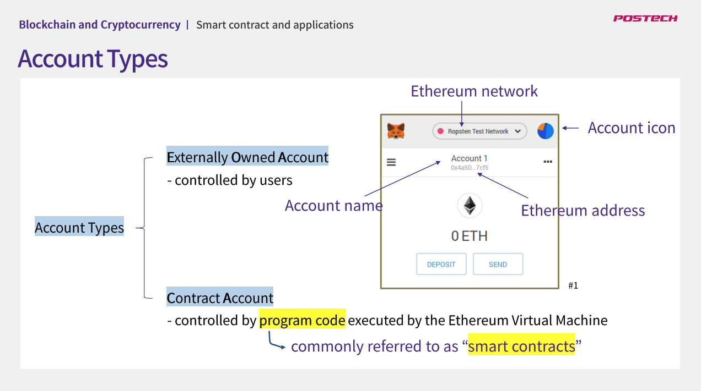
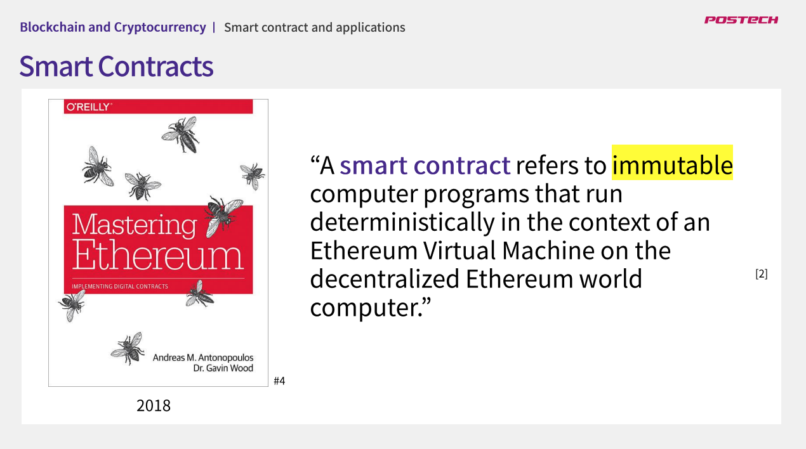
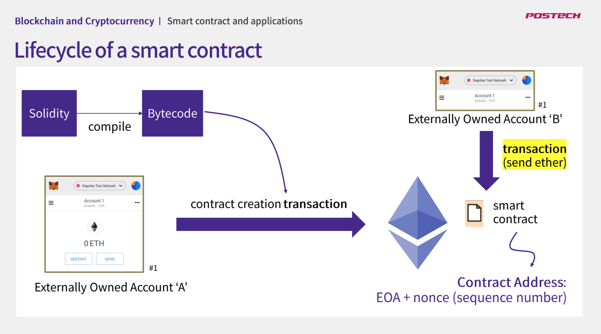
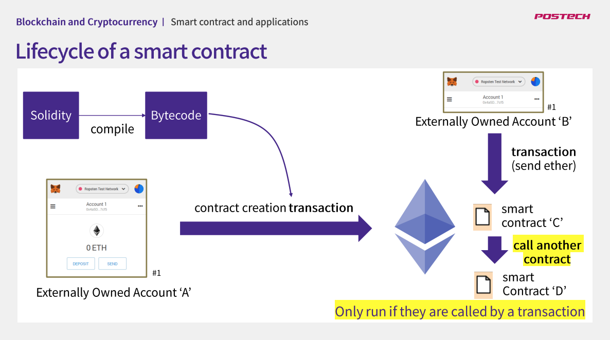
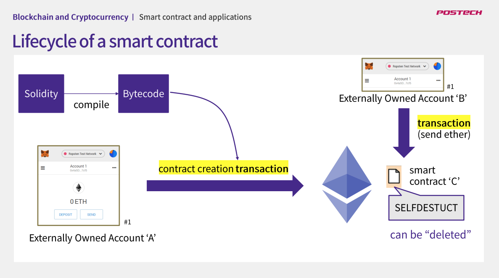
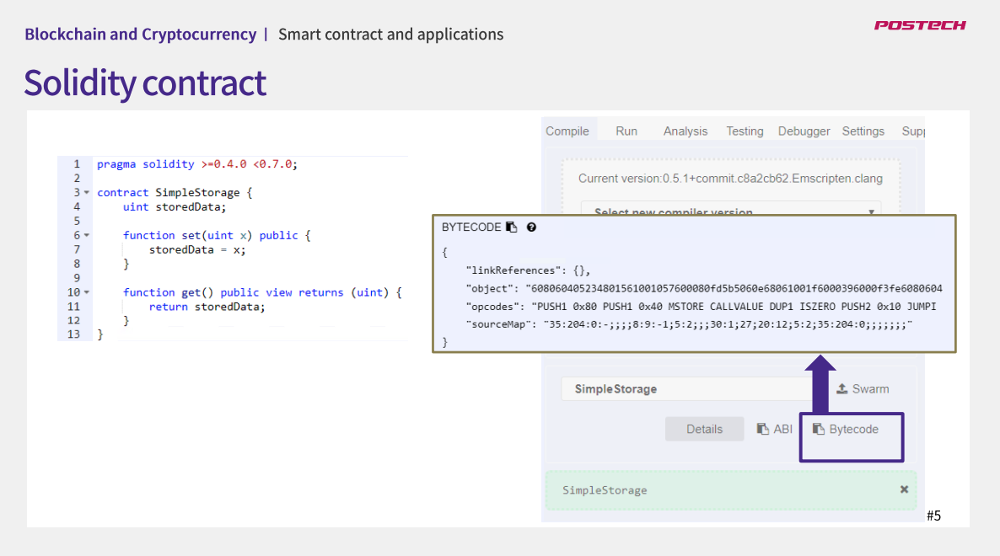
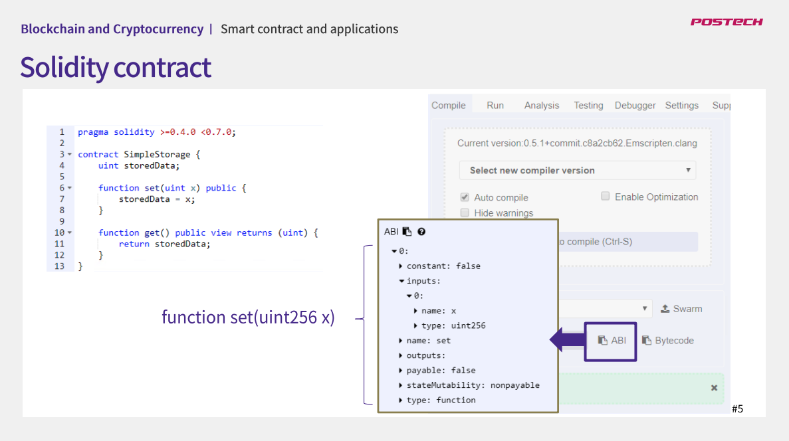
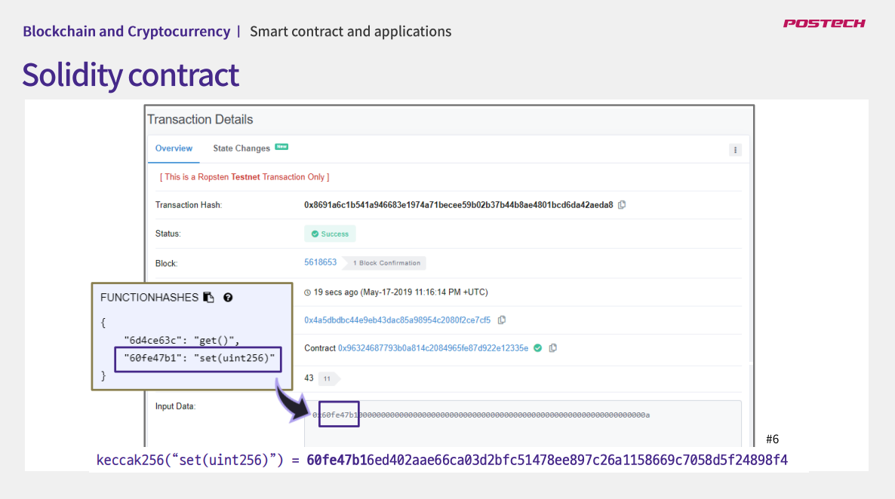
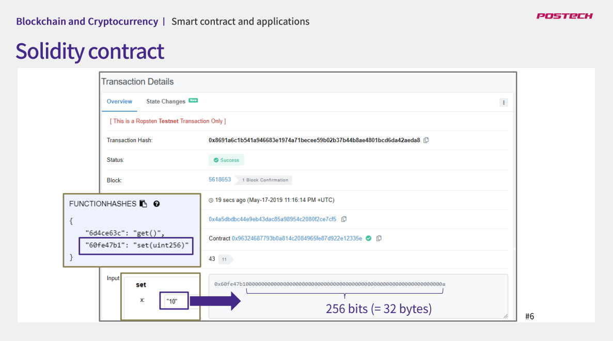

## 강의명 : 스마트계약 및 응용
### 강의 링크 : http://www.kmooc.kr/courses/course-v1:POSTECHk+CSED490U3+2021_T2/video
### 강의에 필요한 자료 : http://www.kmooc.kr/courses/course-v1:POSTECHk+CSED490U3+2021_T2/pdfbook/0/

### 04강. Smart Contract Platform

#### Ethereum Smart Contracts

이더리움 스마트 컨트랙트를 말하기에 앞서 이더리움에서 지원하는 account type을 짚고 가자면, 이더리움에서 지원하는 account type에는 두가지가 있음.
그 중 하나를 스마트 컨트랙트가 사용함.

**이더리움에서의 스마트 컨트랙트란?**

아래 그림에서 보이는 것과 같이 메타마스크 등을 통해서 만들어진 어카운트를 Externally Owned Account, EOA 혹은 외부 소유 계정 이라고 부름
Externally Owned Account는 일반적으로 사용자에 의해서 사용되며 private key에 의해서 관리됨.
한편, 이더리움에는 이 외부 소유 계정 외에도 계약 계정이라고 불리는 contract account가 있음. contract account는 externally owned account와 
달리 private key가 없으며, 이더리움 가상 머신에서 동작하는 프로그램에 의해 관리됨. 이때, 이 프로그램이 스마트 컨트랙트인 것.

CF) 이더리움 창시자는 '스마트 컨트랙트'라는 명칭의 사용을 후회하기도 했음. 이더리움의 스마트 컨트랙트는 스마트하지도 않고, 실제 법률적 효력을 갖는 계약도 아니기 때문에
차라리 "Persistent" 스크립트 같음 이름을 불렀어야 했다고 말했다고 함. 마찬가지로 안드레아 안토노폴로스와 개빈 우드가 같이 쓴 “마스터링 이더리움” 책에서도 
스마트 컨트랙트의 개념을 이더리움 가상머신에서 실행되는 immutable computer program이라고 정의하고 있음

* immutable : 기존의 프로그램과 달리 스마트 컨트랙트는 한번 deploy되면 프로그램 코드를 변경할 수 없음. 변경해서 배포하면 새로운 주소를 갖는 스마트 컨트랙트로
배포되기 때문에 앞에서 배포했던 스마트 컨트랙트는 변경 없이 계속 남아서 실행됨. 이런 의미에서 스마트 컨트랙트는 불변임
* deterministic : 동일한 상태에서 시작을 했다면 누가 실행을 하든 스마트 컨트랙트의 실행 결과는 동일해야 함. 이더리움 가상 머신은 모든 이더리움 노드에서 실행되고
그 결과가 확인 됨. 이런 모습이 마치 하나의 컴퓨터가 동작하는 것처럼 보여서 world computer라고 부름. 이더리움에서는 smart contract를 이런 world computer
상에서 실행되는 불변의 프로그램으로 보고 있음.

**스마트 컨트랙트의 생명주기?**

1. solidity 같은 하이레벨 언어로 작성
2. 바이트 코드로 컴파일
3. 이더리움으로 deploy (contract creation transaction : 이 트랜잭션의 data로 컴파일한 bytecode를 포함시켜서 넘겨주게 됨)

이렇게 만들어진 contract에는 Ethereum address가 주어지게 되는데, 이 address는 이 contract creation transaction을 만든 EOA와 transaction의 순서를
표시하는 nonce 값을 통해서 만들어짐. 따라서 동일한 코드로 컨트랙트를 생성하더라도 account와 nonce 값이 달라지면 다른 주소를 갖는 컨트랙트가 생성되게 됨
이렇게 얻어진 컨트랙트 address를 통해서 contract에 ether를 보낼 수도 있고, contract에 메소드를 호출할수도 있게 됨 (가령, 이 address를 이용해서 외부계정에서
contract account로 이더를 보낼수도 있음)

외부계정으로부터 호출된 contract는 다른 contract를 부를수도 있지만, contract 스스로 실행된다거나 백그라운드에서 실행되지는 않음.

Contract를 변경할 수는 없지만 contract를 지울수는 있음. 그러면 해당 어드레스에 해당하는 프로그램과 상태정보가 사라지고 이 어드레스로 트랜잭션을 보내도 실행할
프로그램이 더 이상 없게 됨

**간단한 스마트 컨트랙트 작성**

실습 사이트 : https://remix.ethereum.org/

contract를 컴파일 하게 되면 2가지 output을 얻을 수 있음.

한가지는 컴파일된 bytecode, 다른 하나는 ABI(Application Binary Interface).
* bytecode > object : 이더리움으로 deploy되는 16진수로 표현된 바이트 코드
* abi 옵션 : 해당 solidity 파일의 ABI. 즉, Application Binary Interface를 보여줌. 이더리움에서 ABI는 contract의 각 메소드가 어떤 argument를 받고
어떤 값을 반환하는지를 정의해 이를 통해서 contract call을 encode 하거나, data를 decode 하는데 사용됨

앞의 4바이트는 어떤 메소드를 호출할 것인지를 나타냄. 즉, 메소드 signature hash값의 처음 4바이트를 이용해서 어떤 메소드를 부르는지를 표현하는데, 슬라이드의 
예제에서는 set 메소드의 hash값을 사용했음. Input data의 나머지 값은 argument로 넘겨진 10을 표현함. Type이 256bit인 정수 값이기 때문에 32바이트로
10을 표현하고 있음. 이 과정을 통해 10을 storage contract의 set 메소드에 보낸다는 정보가 이더리움에서 전달되고 기록되는 것.

EOA는 다른 EOA로 메시지를 보낼 수 있음 (EX. 이더를 주고 받는 경우). EOA는 다른 contract account로도 메시지를 보낼 수 있음. 이는 컨트랙트의 코드를 실행하게 함.
반면 contract account는 자신 스스로 새로운 트랜잭션을 만들 수 없고 항상 EOA에 의해서 시작된 트랜잭션에 의해서 실행됨. 일단 실행된 contract account는
다른 contract account로 메시지를 보내어 다른 contract account가 실행되게 할 수 있음.

각각의 contract account는 자신의 storage를 가지고 있고 외부로부터 전달된 메시지에 따라서 이 값을 
변경하거나 다른 contract로 메시지를 전달하면서 이더리움이 동작함

정리 : EOA는 이더를 주고 받을 수 있는 기본적인 형태의 account. contract account는 프로그램(스마트 컨트랙트)를 실행할 수 있는 account