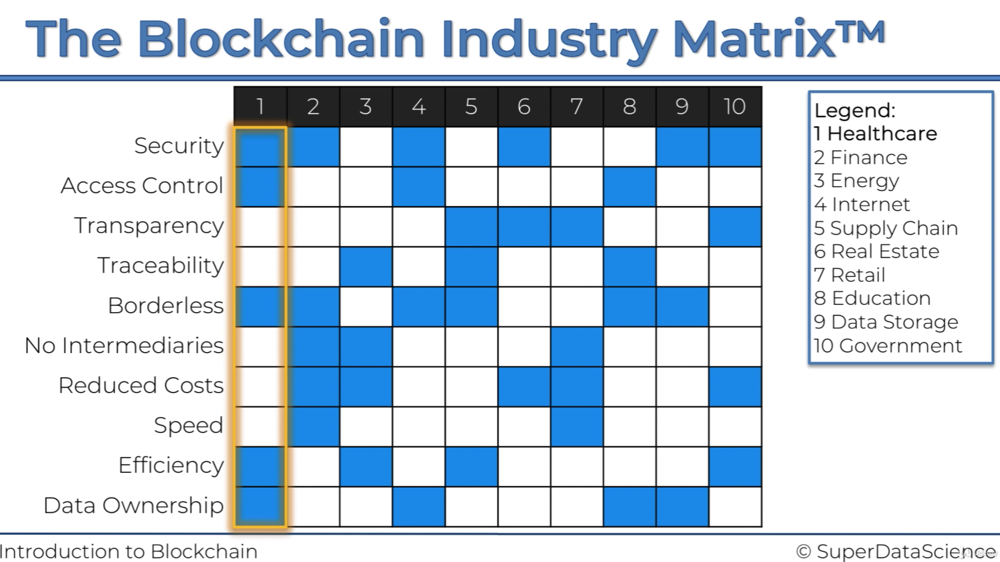

## 강의명 : 【글로벌 Best】 산업 적용 사례와 함께 하는 Blockchain 입문 (한글자막)
#### 강의에 필요한 자료 : https://www.superdatascience.com/pages/blockchain-intro

#### 블록체인이란?
정의 : 지속적으로 증가하는 데이터, 즉 블록이라고 불리는 이 데이터를 암호학을 통해 보호하고 연결하는 기술 (위키피디아)

#### 블록체인을 식별하는 해시(SHA256-64자) 조건: 
1. one-way : 해시로 부터 문서를 재구성 할 수 없어야 함
2. deterministic : 같은 문서를 통해 생성한 해시값은 동일해야 함
3. fast computation : 매우 빠른 계산이 필요. 계산량이 많음
4. the avalanche effect : 작은 변화가 해시값의 완전한 변화를 가져와야 함 (문서와 해시사이의 연결고리를 끊음)
5. must withstand collisions : CF) 비둘기집 원리, 문서의 양 > 해시의 조합 수

#### 블록체인의 위변조가 어려운 이유
해시를 통한 연결특성(previous hash값을 활용해 current block의 hash값을 생성함) 때문에 한 블록을 위조하려면 그 뒤에 연결된 모든블록을 위조해야 하며,
이와 같은 작업을 해당 블록체인을 공유하는 distributed p2p network의 참여 노드 과반 이상에 대하여 해야 함 (참여 노드가 많아질수록 위변조가 어려워짐)

#### 블록체인의 가능성
* Security : 태생적 보안성
* Access control : 데이터 링크의 익명화된 버전에 대한 저장, 실제 데이터에 접근 권한을 부여할 사람을 통제
* Transparency : 실제 사적인 정보를 본다는게 아니라 거래의 발생 여부를 본다는 것 (무언가를 숨기거나, 사라지게 할 수 없음)
* Traceability : 거래 내역을 쉽게 추척할 수 있음, 기록이 유지됨 (무엇이 어디서 왔는지, 진짜인지, 확인하는데 도움)
* Borderless : 한 국가에 국한될 필요 없음
* No Intermediaries : 중개의 핵심은 신뢰를 준다는 것. 하지만 블록체인은 신뢰가 기술 자체에 내재되어 있음. 
* Reduced costs : 기술 자체에 신뢰가 내장되어 있기 때문
* Speed : 기술 자체에 신뢰가 내장되어 있기 때문
* Efficiency : 여러개의 다른 시스템을 이용하는게 아니라 하나의 블록체인을 가짐
* Data ownership : 어떤 기관도 데이터를 소유할 수 없음. (데이터는 사용자 데이터고 어떤 개체도 데이터를 완전히 제어하거나 접근할 수 없는 분산 방식으로 저장 되었기 때문)

#### 비트코인의 장점
* Cross-border transactions
* Faster
* No intermediaries
* Very low fees
* Anonymity

#### 비트코인의 통화정책
* 반감기 : 채굴하는 블록당 리워드로 제공하는 비트코인을 감소시킴 => 비트코인의 통화량 제한
* 블록 프리퀀시 : 비트코인 블록은 특정 빈도로 발생함 => 비트코인 시스템에서는 채굴 과정의 난이도를 자동으로 수정함

#### 비트코인의 채굴
current hash를 구성하는 요소는 data, previous hash, nonce가 있는데 이 중 nonce는 data, previous hash와 다르게 값을 임의로 변경시킬 수 있다.
이때, nonce를 변화시켜서 특정 조건(ex. hash 앞단의 연속된 4자리 수가 0)을 만족하는 해시를 찾아야 하는데 이 과정이 '채굴'이다. 적절한 nonce값을 찾아서 
블록을 찾아낸 사람한테 비트코인 리워드가 지급된다. 
비트코인 네트워크는 블록이 일정 속도에 따라 추가될 수 있도록 채굴자를 제한하기 위해 인위적인 한계점이나 장애물을 만들 필요가 있음

#### 블록체인의 산업별 적용사례

* 헬스케어
  * Medical chain : ('건강을 소유하고 medical chain의 일원이 되세요') 환자가 의사의 바코드를 스캔하면 의사는 바로 블록체인에 있는 우리의 데이터에 접근 권한을 가짐
  * Nebula genomics : ('데이터를 소유하세요') 사람들이 의료 데이터를 저장할 수 있는 블록체인을 만듦
  * Doc.ai : 블록체인 + ai

* 금융 
  * Ripple : 은행을 위해 고안됨. 은행간 초국경 거래를 효율적으로 만들기 위해 고안됨

* 에너지
  * Power ledger : P2P 에너지 거래

* 인터넷
  * web3.0 : 백엔드의 변화를 가져올 것. 중앙 집중식 서버가 아니라 분산 데이터 저장
  * Steemit / DTube : 블록체인 플랫폼

* 공급망
  * Provenance

* 부동산
  * 부동산 거래내역을 블록체인을 통해 기록

* 소매

* 교육

* 데이터 저장 : 데이터 자체를 저장하는게 아니라, 데이터데 대한 메타 정보를 저장함
  * sia : 블록체인이나 블록체인을 사용한 클라우드 저장

* 정부

## 참고
- 【글로벌 Best】 산업 적용 사례와 함께 하는 Blockchain 입문 (한글자막) : https://www.udemy.com/course/best-blockchain/