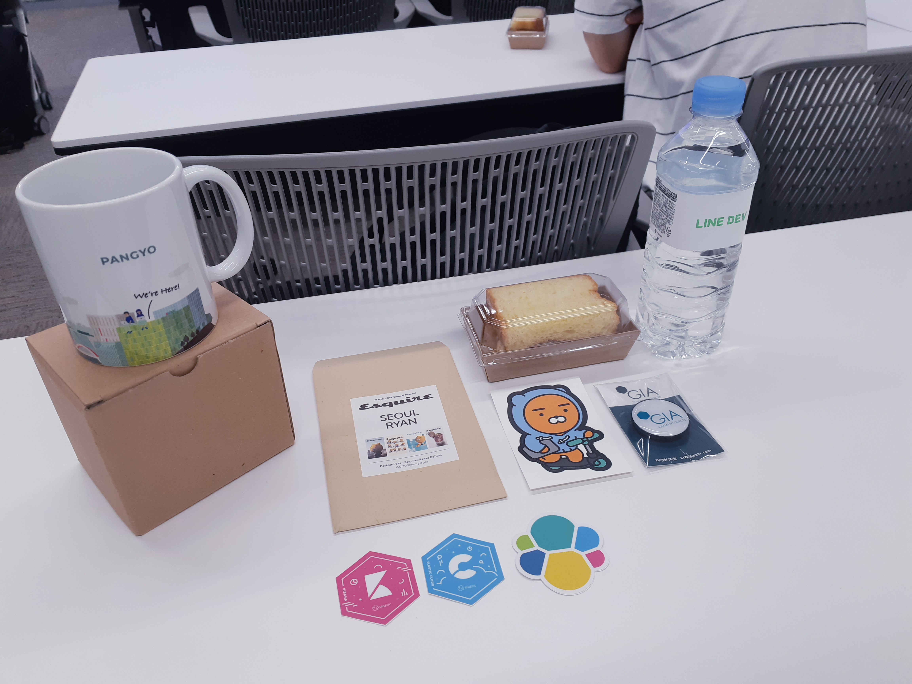

부분 꿈을 안고 회사에 입사한지 벌써 5개월, 하지만 회사에서 하는 업무는 기대했던 것과는 조금 달랐다. 개발 업무를 하고 싶어 들어갔지만 당분간 배치된 부서에서 해야하는 일은 QA업무. 하지만, 낙담하고 있을 수만은 없었기에 내 나름대로 실력을 키울 방법을 찾아보고 싶었다. 물론 알고리즘 문제풀이 등 기존에 알고있는 방법들도 있었지만, **실질적인 개발에 참여하면서 활발한 인터렉션(ex. 코드리뷰)**이 있는 활동에 참여하면 좋겠다고 생각했다. 어떤 방법이 좋을지 후보들을 떠올려 보니, '오픈소스'만한게 없다는 생각이 들었다. 하지만, 기존의 오픈소스 프로젝트들에 어디서부터 어떻게 참여해야 될 지 감이 전혀 오지 않았다. 그러던 차에 눈에 들어온 행사하나. `2019 오픈소스 개발자 이야기`는 이와 같은 고민을 하던 내게 고민 해결의 실마리를 제시해 줄 수 있을것만 같았다.

| 시간 | 발표제목 | 강연자 |
|:--------|:-------:|:--------:|
| 12:30 ~ 13:00 | 사전등록확인 | Staff |
| 13:00 ~ 13:40 | 오픈소스 보고, 응용하기 | 권문범 Naver Corp. |
| 13:40 ~ 14:20 | 국제화/번역과 함께하는 오픈소스에 대한 경험 및 노하우 | 최영락 MS korea Dev PMM |
| 14:20 ~ 15:00 | 회사원에서 오픈소스 개발자로 거듭나기 | 방진호 / 고병권 삼성전자 공동발표 |
| 15:00 ~ 15:10 | 쉬는시간 | |
| 15:10 ~ 15:50 | 당신도 할 수 있는 오픈소스를 이용한 Application 완성도 높이기 | 이경일 Naver Corp. |
| 15:50 ~ 16:30 | 나는 어쩌다 오픈소스 프로젝트 멤버가 되었나? | 권혁진 Databricks |
| 16:30 ~ 17:10 | 오픈소스 스프린트 : 기획부터 실행까지 | 이희승/이서연 LINE |
| 17:10 ~ 17:20 | 쉬는시간 | |
| 17:20 ~ 18:20 | 오픈소스 개발자에게 듣다 | 대담 |
| 18:20 ~ 18:30 | 경품 추첨 및 마무리 | |
|=====

<figure style="padding: 0px; margin-top: 0px">
  <figcaption>2019 오픈소스 개발자 이야기 시간표.</figcaption>
</figure>

그렇게 행사 티켓을 구매한 후, 얼마간의 기다림 끝에, 약간의 설렘과 함께 행사장에 도착했다. 행사는 한국 마이크로소프트에서 장소대여를 해 주신덕에 그 곳에서 진행됐다.

<figure class="align-center">
  
  <figcaption>한국 마이크로소프트 내부. 탁 트인 열린 공간이 인상적이다.</figcaption>
</figure>

<figure class="align-center">
  
  <figcaption>한국 마이크로소프트 외부. 경복궁이 한눈에 내려다 보인다. </figcaption>
</figure>

나는 조금 일찍 행사장에 도착한 편이었는데 그때까지는 행사장이 한산했기에 좋은 자리를 맡을 수 있었다. 자리를 맡은 직후, 참가자 등록을 했는데 주최측에서는 몇가지 행사 참가기념 굿즈를 제공해 주셨다. 이런 굿즈들을 기대하고 행사에 참여하는 것은 아니지만 막상 받으니 괜히 뿌듯했다(이런 것들이 또 오프라인 행사의 묘미가 아닐까 하는 생각이 든다).

<figure class="align-center">
  
  <figcaption>주최측에서 제공해주신 굿즈. 이 외에 행사 후에도 추첨을 통해 추가적인 상품들(안마기, 책, 티셔츠 등)을 증정해 주셨다.</figcaption>
</figure>

행사 시작시간이 가까워 질 수록 많은 분들이 오셨기에 자리가 굉장히 빡빡히 들어찼다. 나중에는 공간을 확보하기 위해 기존의 테이블들을 앞으로 조금씩 밀어야 할 정도였다.

곧이어 네이버의 권문범님의 `"오픈소스 보고, 응용하기"` 세션을 기점으로 성황리에 행사가 시작됐다. 문범님은 본인이 네이버 핵데이에 멘토로 참여했던 경험을 언급하면서 이야기를 시작하셨는데, 핵데이에 참여한 많은 학생들이 대부분 오픈소스를 가져다 '사용만'했다는 측면에서 아쉬웠음을 언급하며 과연 우리는 오픈소스를 제대로 사용하고 있는지에 대한 질문을 던지셨다. 이에 대해 문범님은 오픈소스를 단순히 가져다 쓰는 것만으로는 부족하며, 진정으로 오픈소스를 '사용'하기 위해서는 **그것이 어떻게 만들어졌고 또 왜 만들어졌는지 의구심을 가지고 주도적으로 알아봐야 한다**고 말씀하셨다. 사실 나도 오픈소스를 보통 사용만 했지, 그 내부를 들여다 본 적은 없었기에 좀 뜨끔했다.
다행히도 문범님은 오픈소스를 제대로 이해하고 사용하기 위한 3가지 단계를 말씀해주셨다 (실제 강연에서는 본인이 아래와 같은 방법을 통해 어떻게 Rx Swift를 공부했었는지 예를 들어 설명해 주셨으나 여기서는 간략히 핵심만 요약했다).

**1. 오픈소스의 공식 문서를 잘 읽어라.**  
오픈소스에서 제공하는 문서는 해당 오픈소스에서 사용하고 있는 중요한 개념들을 정리해 놓은 경우가 많은데 이를 이해하면 제작자의 의도를 파악할 수 있으며, 또한 추후 프로그래밍을 함에 있어 중요한 자료를 확보하는 것과 같기에 강조해 주셨다.

**2. 소스를 통한 구조를 파악하라.**  
오픈소스는 이름 그대로 소스가 모두 공개되어 있기에 열람에 제약이 없다. 때문에 앞선 문서 상에서 획득한 키워드를 활용해 차근차근 소스를 읽어나가야 한다고 언급해주셨다.

**3. 스터디와 커뮤니티를 활용하라.**  
사실 너무 방대하고 양이 많기에 혼자 공부하기 어려울 수 있는데 이 때는 스터디와 커뮤니티를 활용하는 방안이 효과적일 수 있다고 말씀해주셨다. 사실 이 부분까지는 어찌보면 일반적인 이야기이기 때문에 예시가 항상 궁금했었는데 때마침 문범님은 오픈소스 언어 분석 스터디인 '펀펀스터디'에 참여했던 본인의 경험을 예로 들어주셨다. 이 스터디 같은 경우는 다음과 같은 방식으로 진행되었다고 한다.

1. 소스를 분석한다.
2. 알고리즘 풀이를 통한 접근을 해본다(다양한 언어를 통해 알고리즘 문제를 풀어보면서 오픈소스에 사용된 복수의 언어들에 대한 이해도를 높인다).
3. 책을 이용하여 공부한 내용을 발표한다.
4. 오픈소스 구조를 활용한 새로운 소스를 개발한다.
5. 실제 오픈소스에 기여한다.

위의 스터디 방법에서 특히 인상깊었던 부분은 알고리즘 문제를 통해 오픈소스에 쓰인 (본인의 주력 언어 외에) 다른 언어에 대한 이해를 심화시킨다는 점과, 오픈소스 구조를 '활용'한 새로운 소스를 개발한다는 점이었다. 이 부분은 추후 오픈소스를 이해하기 위한 스터디를 구성한다고 했을 때 꼭 적용해봐야 겠다고 다짐했다.  

이후 문범님은 이와 더불어 오픈소스에 대한 몇가지 조언들도 덧붙여 주셨다. 오픈소스를 사용할 때, 구조적 특징을 파악해야 한다는 것, 맹목적인 신봉보다는 필요한 부분을 분석할 것, 비슷한 부분은 **직접 만들어 보며** 본인의 실력을 키울 것 그리고 새로운 방식에 대한 무조건적 찬양 혹은 비난을 지양할 것 등이었다. 덕분에 (모든 배움에서 마찬가지겠지만) 오픈소스에서도 역시 비판적 수용이 중요함을 다시 한 번 환기시킬 수 있었다.

다음은 한국 MS 최영락님의 `"국제화/번역과 함께하는 오픈소스에 대한 경험 및 노하우"`시간이었다. 영락님의 경우는 번역을 통해 오픈소스에 기여한 경험을 말씀해 주셨는데, 정말 우연한 기회로 오픈소스 번역을 시작하셨다고 하셨다. 영락님이 처음 번역을 시작한 오픈소스는 '오픈스택'이라는 프로젝트인데, 페이스북에 간간히 올라오는 오픈소스 번역 관련 글들을 보다가 문득 과거에 들었던 강연을 통해 이미 알고있었던 프로젝트인 오픈스택을 번역해 보기로 결심하셨다고 했다. 그렇게 꾸준히 몇 단어씩 번역을 하는 것으로 시작해 300단어 번역이 넘어간 시점에 이르자 'Active Technical Contributor'란 수식어와 함께 오픈스택 서밋 티켓이 주어졌고, 티켓도 무료인데 서밋에 가보자는 생각으로 영락님은 해당 서밋에 참여하게 되셨다고 한다. 그리고 거기서 오픈스택 국제화 팀 구성원들과 많이 친해지셨다고 했다. 이 서밋이 계기가 되어 이후에도 오픈스택 번역에 꾸준히 참여한 영락님은 현재 오픈스택 팀 리드까지 맡고 계시다고 한다. 더불어 KOSSLAB(Korea Open Source Software LAB) 글로벌 오픈 프론티어 활동, 다른 번역 프로젝트(Askbot, Django, Kubernetes 등)에도 기여하신다고 하니 정말 대단한 활동력이 아닐 수 없다.

영락님은 이후 번역작업과 관련된 여러가지 이야기들을 들려주셨는데 이는 번역 도구의 다양성, 용어집, 번역이 애매한 단어들(ex. contributor를 '기여자'라고 표현할 것인가?), 언어코드, 언어별 단수/복수 형태에 대한 처리와 같은 주제들이었다.

몇가지 크게 기억나는 것만 정리해 보자면 번역 도구의 경우, 개발도구가 다양한 것처럼 번역도구도 나름 여러가지가 있음을 말씀해 주셨다. 사실 영락님의 이야기를 듣기 전까지는 번역도구가 있다는 것도 사실 몰랐었다. 영락님이 언급한 PO파일(번역 파일 저장 형식)을 다루는 여러 번역 도구들 중에는 POEdit, Transifex, Pootle, Zanata, Weblate, Crowdin 등이 있었다. 번역 도구들 같은 경우 어떤 도구가 가장 좋은지 콕찝어 정하기는 쉽지 않다고 한다. 정답은 없고, 다만 **상황과 환경에 가장 적합한 도구를 선택할 필요가 있다**고 하셨다. 그리고 일반적으로 상용 온라인 번역 도구들 같은 경우에 번역하는 대상이 오픈소스임을 인증하면 무료로 제공된다는 팁을 주셨다.  

**[번역 도구들에 대한 좀 더 자세한 이야기]**  
**POEdit** : PO라는 형식을 가진 파일을 쉽게 PC에서 편집 후 저장 가능한 도구이며 PO 파일을 직접 편집할 수 있는 오픈소스라면 어디서든 사용 가능함  
**Transifex** : 상용 온라인 번역 도구로, 온라인 협업을 위한 기능 등 강력한 기능을 제공한다. (Askbot, Django등의 프로젝트들이 번역에 이 도구를 사용한다고 한다)  
**Pootle** : 온라인 번역도구인데 현재 maintain이 저조하다.
**Zanata** : 자바를 기반으로 하는 온라인 협업 오픈소스 번역도구인데 역시 현재 maintain이 저조하다.
**Weblate** : 깃허브와의 통합을 강조하는 웹기반 번역도구로, 오픈소스 설치 버전, 클라우드(유료) 버전이 있다. 아직까지 규모가 큰 오픈소스에서의 사용사례는 나오지 않고 있다.  
**Crowdin** : (역시 번역도구의 한 종류)  
{: .notice--info}

또 용어집의 중요성에 대해서도 많이 말씀해 주셨는데, 번역시에 용어집이 제대로 정립되어 있지 않으면 용어의 일관성이 없어져 번역의 질이 저하되는 경우가 생긴다고 말씀해 주셨다.

오픈소스 번역과 관련해서 이번과 같이 깊게 이야기를 듣게된 건 처음이라 신선했던 세션이었다. 만약 이 세션이 아니었다면 번역을 통해 오픈소스에 기여할 수 있다는 사실을 계속 망각한 채 지냈을지도 몰랐겠다는 생각이 들었다. 이 후에도 많은 이야기들이 준비되어 있는 듯 했으나 아쉽게도 시간 관계상 다음 세션으로 넘어가게 되었다.

다음 세션은 삼성전자 방진호, 고병권님이 `"회사원에서 오픈소스 개발자로 거듭나기"`라는 주제로 공동발표를 해주셨다. 현재의 내 상황에 적용해 볼 점들이 많을 것 같아 이번 행사에서 제일 기대를 많이 했던 세션이었다. 그래서인지 연사들의 발표에 더 귀를 기울였다. 먼저 방진호님이 이번 세션의 강연을 시작하셨다. 진호님 같은 경우에도 입사 초기 개발직무로 배치되지 않으셨다고 한다. 얼마간의 어필 끝에 직접 코딩을 하는 직무로 전환배치 되었으나, 다양한 이유(인간관계, 조직비전, 금전, 관심과는 다른 기술스택 등)로 해당 부서와는 맞지 않는다고 판단하여 진호님은 다시 이직 및 잡포스팅(Job Posting : 삼성전자의 직무 변경제도)에 도전하셨다고 한다. 물론, 이 또한 쉽지 않아 우여곡절 끝에 현재 근무하고 계신 부서에 갈 수 있었다고 한다. 하지만 주어진 업무는 다시 개발이 아닌 업무. 그래서 진호님은 실망끝에 그렇다면 현재상황에서 '본인이 할 수 있는 일은 무엇일까?'라고 생각하셨다고 한다. 어렴풋이 객관적인 능력증명서가 필요함을 느끼고 있을 무렵, 진호님은 2014년 당시 'OSS 오픈소스 개발자 이야기' 행사에 참가하셨고 여기서 '오픈소스 커미터가 되면 회사로부터 독립적이게 될 수 있겠구나!'하는 깨달음을 얻으셨다고 한다. 그렇게 진호님은 본인의 선호와 업무 영역이 겹치는 오픈소스 프로젝트(이 프로젝트가 바로 Chromium/Blink)를 선택해 커미터가 되기로 결심하셨다.

Chromium의 커미터가 되기 위해서는 20개의 커밋이 필요하다고 한다. 그렇기에 진호님은 커미터가 되기 위해 작은 패치부터 도전하기 시작하셨는데, 아래는 진호님이 순차적으로 했던 시도들과 그 시도들에 대한 부연설명이다.
1. 크롬 열심히 사용해 보기 : 하지만 갓-크롬. 너무 완벽해서 문제를 찾기 힘듦
2. 무작정 코드 들여다보기 : 고칠 부분을 찾아서 고쳐봤지만, 이 방법은 지속적인 기여가 어려움
3. FIXME, TODO 검색하기 : 해당 이슈들은 초보자가 대하기에는 너무 어려움
4. 모든 ISSUE를 다 들여다보기 : 계속 보고 있다가 쉬운것을 빠르게 낚아채서 기여. 지속적인 반복으로 어느정도 기여할 수 있었음 (팁: 초심자의 경우는 GoodFirstBug라는 초심자를 위한 쉬운 이슈들을 노리면 좋다. 하지만 빠르게 없어지니 유의할 것)

진호님은 위와 같은 작은 패치 시도들을 통해 빌드/테스트, 이슈 트래커 관리, 코드리뷰, 테스트 작성, 패치 사냥법등에 익숙해 질 수 있으셨다고 한다. 하지만, Chromium의 커미터가 되기 위한 20개의 패치에서 각 패치들은 '사소한'게 아니라, '중요한'기능을 구현해야 하는 패치여서 앞선 패치들은 카운팅되지 않았다고 하셨다. 진호님은 의미 있는 커밋을 하기 위해 다음 전략을 실행하셨는데, 이는 바로 '상호운용성(Interoperability)'. 즉, 진호님은 **다른 브라우저에는 있지만 크롬에는 없는 기능들이 뭔지를 알아내 해당 기능들을 구현하는 전략**을 취하셨다고 했다. 신규 구현이다 보니 앞선 자잘한 패치들과는 달랐다. 이슈를 리포팅하고, 구현을 위한 웹 표준 스펙을 읽고, 기능 구현을 위한 공식 메일을 보내고, 코드리뷰를 받고, 테스트 코드를 작성하고, 다시 코드리뷰를 받고, 통과를 하기까지의 과정들을 거쳐야 했다. 물론 그 과정들이 쉽지 않았지만 진호님은 이러한 단계를 거쳐 종국에는 커미터가 되셨다고 한다.

진호님이 오픈소스 커미터가 되기위한 과정중에서 어려웠던 점으로 꼽았던 것들은 다음과 같았다.

1. 영어
2. 패치 실패
3. 친절함 없는 리뷰어들 ('일부' 리뷰어의 경우 좀 불친절하다고 한다)
4. 이슈 트래커의 경쟁자들
5. 패치 도둑 (패치를 그대로 배끼는 사람이 있다고 한다)

오픈소스 커미터가 된 이후에는 많은 기회들이 생기고 그 외의 긍정적인 현상들도 일어났다고 하셨다. BlinkOn을 비롯한 여러 컨퍼런스에 참여할 수 있는 기회들, 다른 오픈소스 관련 활동 참여, 자신감 향상 등등. 하지만 그 중에서도 가장 보람찼던 것은 단연 **개발자로서 크게 성장**할 수 있었다는 점었다고 하셨다. 진호님은 오픈소스 활동을 통해 코드를 읽는 능력, 코드를 리뷰하는 능력, 설계 및 구현 능력, 협업 및 커뮤니케이션 능력 그리고 개발에 대한 열정이 크게 자라났다고 하셨다. 물론, 당부의 말씀도 함께. 오픈소스 만능주의라던가, 이 활동 때문에 회사일을 등한시 한다던가, 신체 및 정신 건강에 신경을 많이 못쓴다던가 하는 점들은 주의해야 할 점이라고 말씀해 주셨다 (역시 회사일과 병행하기엔 많은 열정이 필요한 일이기 때문일 것이다).

이어서 고병권님이 마이크를 넘겨받아 강연을 계속해주셨는데, 병권님 같은 경우는 입사 초기, 본인의 포지션을 '회사원'으로 생각했기에 회사생활에 큰 불만이 없으셨다고 한다. 하지만 회사일에 대한 회의감, 다른 직군으로의 스카웃 제의 등의 일을 겪으며 본인에 대해 깊게 고민하는 시간을 가지셨다고 한다. 고민끝에 내린 결정은 자신의 가치를 스스로 표현 가능한 진정한 '개발자'가 되는 것이었고 병권님은 그 수단으로 오픈소스를 선택했다. 
병권님 역시 오픈소스로 Chromium 을 선택했는데 그 이유로는 해당 오픈소스를 접해본 경험이 있었고, 많은 사람들이 사용하는 소프트웨어였기 때문이라고 말씀해주셨다. 하지만 문제는 **꾸준함**이었다. 병권님은 어떻게 본인을 꾸준히 오픈소스에 기여하게 할까 고민한 끝에 다음과 같은 방법들을 실천하게 되었다고 하셨다.
1. (해당 오픈소스 관련) 컨퍼런스 지속 참여
2. 강제성(벌금) 도입
3. 학습의 양과 질을 담보하기 위해, 본인이 맡은 부분에 한하여 강의 약속을 잡고, 많은 청중들 앞에서 발표하기(병권님은 이를 '벼랑 끝으로 MOVE'라고 표현해 주셨다.)
병권님 역시 이러한 오픈소스 관련 활동을 통해 본인에게 많은 변화가 있었다고 했는데, 일단 스스로 많이 성장했음을 느꼈으며, 전에 없던 많은 발표요청이 들어오기 시작했고, KOSSLAB 활동과 같은 좋은 기회를 잡을 수 있었다고 말씀해 주셨다. 그리고 가장 중요한 점. 본인을 당당하게 '개발자'라고 소개할 수 있게 되었다는 점이다. 병권님 역시 마지막으로 당부의 말을 남기며 강연을 마치셨다. '오픈소스를 생각한다면, 자신만의 방법으로 꾸준하게 하십시오'.

3번째 세션을 듣고나니 어떻게 오픈소스 프로젝트에 접근해야 할 지 조금은 더 힌트를 잡을 수 있었다. 그리고 또 한가지 느낀점은 (역시나 뻔한 얘기지만) 내가 앞서 고민했던 것들이 결국 모두 '의지의 문제'일 수 있겠다는 생각이 들었다. 오픈소스를 통해 프로젝트는 언제 어디에서나 진행되고 있으며, 배울 수 있는 길은 인터넷을 통해 모두 열려있다. 부서탓만 하기에는 아직 한 게 아무것도 없다고 생각되었다. 체력과 시간 안배가 관건이겠지만, 할 수 있는 한 최선을 다해야겠다는 다짐을 다시금 할 수 있었다.

3개의 세션이 모두 끝난후, 잠깐의 쉬는시간이 찾아왔다. 한창 출출할 무렵이었는데, 주최측에서 간식을 제공해주셨다. 잘 패키징된 간식거리들과, 시원한 음료였다. 오후 1시부터 몇시간 동안 연속적으로 강의를 듣다보니 조금은 피곤했지만, 곧 다음 세션들이 시작하기에 제공받은 요기거리들로 허기를 채우고 바람을 쐬며 숨을 돌렸다. 눈 깜짝할 새 쉬는시간이 지나가고 바로 다음 세션이 시작했다.

다음 세션의 이야기는 `2019 오픈소스 개발자 이야기를 다녀오다 #2`에 기술 예정입니다.  
`2019 오픈소스 개발자 이야기`의 발표자료는 [여기](#)에서 다운받으실 수 있습니다.

