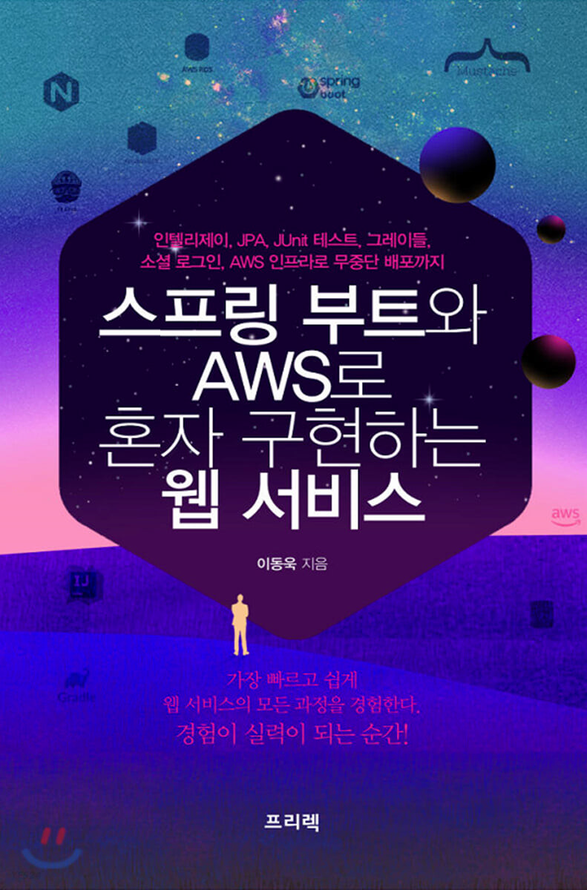
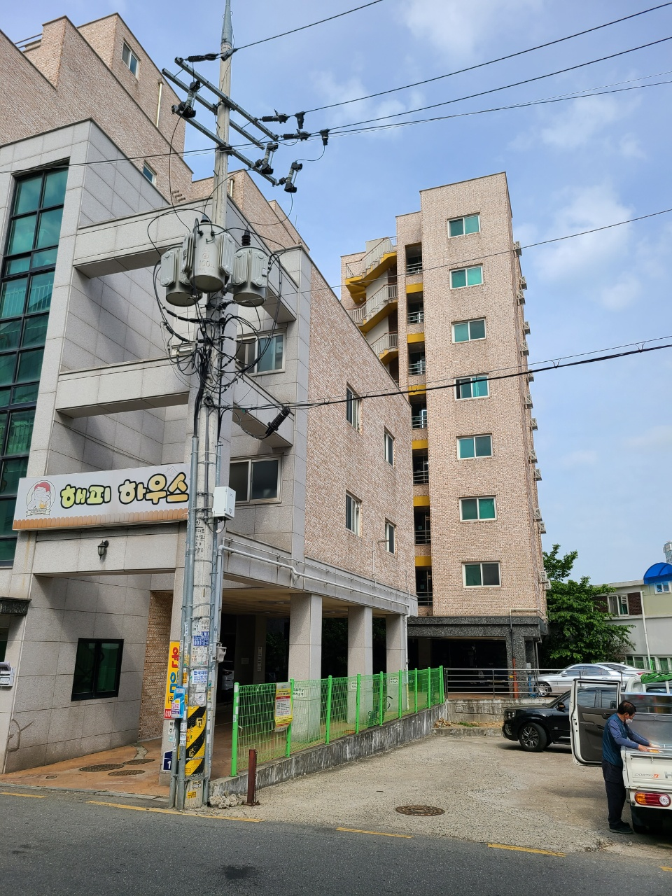
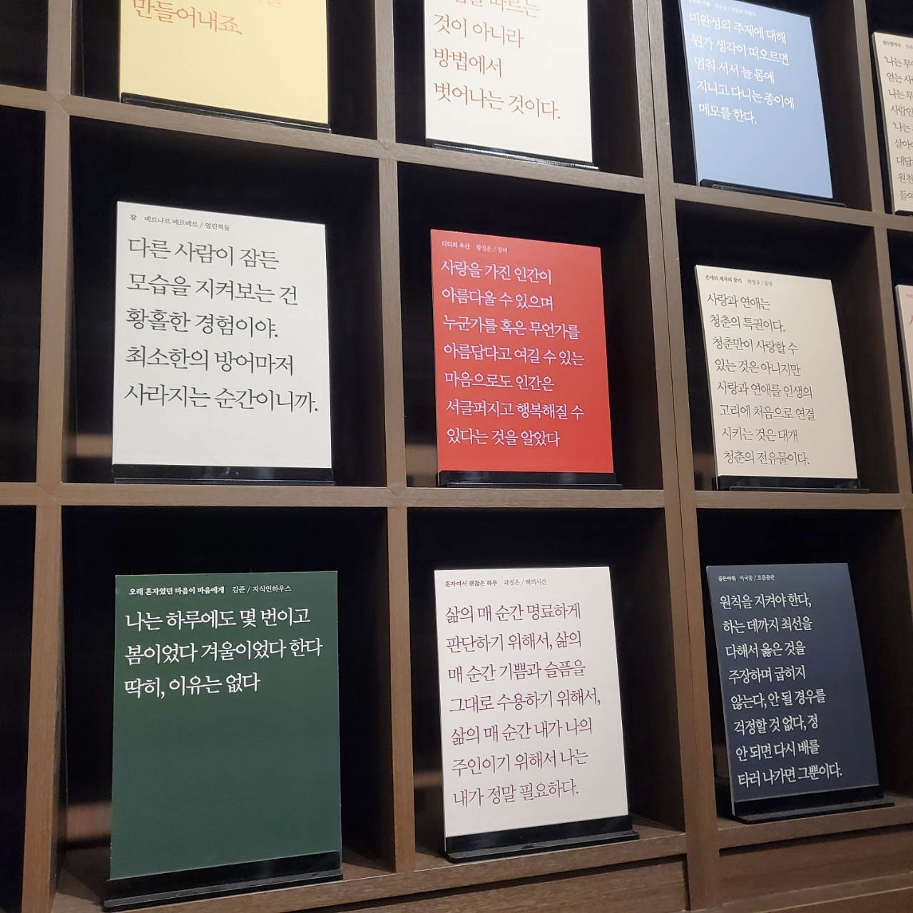

## 목차
- 개발관련 있었던 일
  - Spring Batch 서비스 유지/보수 및 기능개발 일부
    - Spring Batch 담당 모듈 부하 집중현상 개선
    - Spring Batch 담당 모듈 Test 환경 적립
    - Spring Batch 담당 모듈 기능 문서화
  - 인턴 멘토
  - 알고리즘 문제 풀이
  - 프로그래밍 관련 도서 / 강의 수강
  - 삼성 사내교육(Associate Architect) 수강
  - 깃, 리눅스 관련 지식 습득
- 생활관련 있었던 일
  - 이사
  - 연애
  - 자동차 구매 및 운전
  - 피티(PT)
  - 재태크
- 새해에는?
  - 업무적 목표
  - 배우게 된 내용에 대한 기록
  - 소홀했던 영어공부 다시 신경쓰기 (회화 및 테크니컬 라이팅 위주)
  - 감을 잃지 않기 위한 알고리즘 문제 풀이
  - 오픈소스 참여
  - 현재 사용하고 있는 기술에 대한 심화 공부 (스프링부트/스프링 배치 등)
  - 구매한 기술서적 정독
  - 이직 및 창업에 대한 관심 경주하기
  - 사이드 프로젝트
  - 미래계획
  - 주간 목표 세우기
  - 재테크
  - 링크드인 업데이트

 
## 개발관련 일
  
### Spring Batch 서비스 유지/보수 및 기능개발 일부
부서에 와서 처음으로 담당하게 된 모듈은 Spring batch 관련 모듈이었는데 2020년 들어서 관련된 모듈을 하나 더 맡게 되었다. Batch쪽 업무를 담당하고 있다보니,
이제 하나 둘 씩 Batch 관련 모듈의 운영/관리 책임이 내게 주어진 것이었는데, 나름 Spring batch 관련해서 이런저런 자잘한 변경들을 한 것 같다.
* 새로운 Job을 추가하거나
* Job간 매끄러운 수행을 위해서 스케줄링 타임을 조절하거나 (현재는 Spring Framework의 @Scheduled로 충분하기 때문에 @Scheduled 이용..Quartz를 이용하는 순간도 오려나?)
* 특정 Job의 수행시간이 길다 싶어서 병목 지점을 찾아내 수행시간을 감소시키고 (쿼리 튜닝, 테이블 재생성/재생성 주기 최적화 등의 방법 사용)
* batch 모듈들의 테스트 환경 정립 및
* 담당 모듈들의 기능들을 문서화 하는 작업

등을 했다. 하지만 전반적으로 되돌아 봤을 때, 신규 기능개발은 상대적으로 많이 하지 못한 것 같다. 오히려 안정적인 서비스 운영을 위한 유지/보수 및 테스트 환경을 구축에 
더 많은 시간을 쏟은 것 같아 아쉽다. 하지만 꼭 신규 기능개발이 아니더라도 유지/보수 작업 및 테스트 환경 작성을 하면서 배울점도 많았다. 가령, 메인 DB로 사용하고 있는
Redshift의 테이블 속성 파악 및 SQL 쿼리 튜닝을 통해 Job 수행시간 병목지점에 대한 해소가 필요했는데, 이 과정에서 Redshift의 설계취지/속성/기능 등에 대해 보다 자세히 이해 할 
수 있었고, 실 PRD 환경에서 SQL 쿼리 방식이 얼마나 실행시간에 크게 영향을 미치는지 깨달을 수 있었다 (SQL 구문분석 후 불필요하다고 생각한 작은(?) 부분을 제외 했는데 PRD에서 
쿼리 수행시간의 꽤나 많은...증가가 있던 사건이 있었다). 또 테스트 환경 작성 과정을 통해서는 어떤 테스트가 좋은 테스트인지, 그래서 모듈 특성에 맞게 어떻게 테스트를 구성하면 좋을지
많은 고민을 할 수 있었다. 답답했던 점은 그 환경을 구축하면서 '정말 이 환경이 최적에 맞는가?'에 대한 갈증이 있었지만, 정답이 있는 부분은 아닌것 같으니, 앞으로도 주변 분들의 조언 및 
지속적인 학습을 통해 개선해 나아가야 할 것 같다.

담당하고 있는 모듈들의 문서화 작업또한 어쩌면 2021년에 한 작지만 의미있는 작업이라고 생각된다. 항상 문서화 작업을 하다보면, '꼭 이런걸 해야하나?' 이 시간에 한줄이라도 코딩을 더 
하는게 남는게 아닌가? 하는 생각이 들때가 있는데 작성하고는 그 문서를 꽤나 유용하게 사용했던 것 같다. 가령 특정 Job의 내용을 파악하기 위해 Job을 구성하고 있는 모든 코드를 들여다
볼 필요 없이, 정리된 문서를 보고 상대적으로 빠른 시간동안 파악할 수 있었기 때문이다. 그리고 문서 작성을 통해 역설적으로 코드를 더 완전하게 이해할 수 있는 계기도 되었다.
그리고 추가적인 장점은, 다른 사람들도 앞서 작성된 문서를 참조함으로서 해당 코드 부분에 대한 이해에 도움을 받을 수 있다는 것이다. 물론, 문서를 작성함에 따라 
최신화 등의 이슈가 동반되기는 하지만 '문서를 꼭 작성해야 하는가?'에 대한 귀찮음이 떠오를 때면 올해의 일을 상기하면 좋을 것 같다. (문서가 필요 없는 가독성 좋은 코드도 좋지만, 
어쨌건 문서를 통한 이해가 코드리딩 보다는 소요되는 시간이 적다)

다시 기능 개발 및 유지/보수 얘기로 돌아오자면, 2022년에는 새로운 기능개발에 더 적극적으로 임해야 겠다고 다짐했다. 결국은 내 성장 및 작업 속도의 문제인데, 
현재 하는 업무를 보다 빠른 속도로 처리하고 기능개발에 대해서도 협력업체분들보다 한발 빠르게 접근해야겠다고 생각한다. 내 기회는 내가 만드는 것이기 때문이다. 
2022년에는 올해보다 힘좀 내 봐야지.

### 인턴 멘토
예상하지 못했는데 얼결에 '삼성전자 글로벌 인턴십' 프로그램에 멘토로 참여하게 됐었다. 우리 파트에 지원한 인턴분의 사수 역할을 담당하였는데, 어떻게 보면 파트에서의
첫 직속 후임을 맞이한 느낌이라 내게도 매우 뜻깊은 사건이었다. 하지만 거의 신입(?)이 신입을 멘토링 하는 것은 역시 쉽지많은 않은 일이었다. 하하. 최대한 좋은 경험을,
또 회사 선택에 도움이 될만한 현실적인 이야기들을 많이 남겨주고 싶었는데 잘 됐는지 모르겠다. 셀 분들의 도움을 받아 OJT 계획서를 제출하고 랜딩 교육 담당 및 
샘플 프로젝트 진행 감독을 했다. OJT에서는 파트 환경에 대한 교육 및 샘플 프로젝트 진행을 위해 Spring Boot / Spring WebFlux / 각종 AWS 관련 내용 
이 포함됐었는데, 내가 아는 부분에 대해서는 잘 알려줄 수 있었지만, 어째 질문이 들어오면 들어올수록 지식의 밑천이 드러나는 것 같아 많이 부끄러웠다. 아직도 참
갈길이 먼 개발자라는게 실감나는 순간이었다. 그래도 셀 분들이 물심양면으로 도와주신 끝에 잘 마무리 할 수 있었다. (잘 지내고 계시죠? OO님? ㅎㅎㅎ)

### 알고리즘 문제풀이
어떤 일이든 꾸준하게 하지 않으면 감이 떨어지게 마련인데, 알고리즘 문제풀이는 그 정도가 더 심한것 같아서 억지로라도 하려고, 적어도 2주에 한번 1문제라도 풀자는
취지의 스터디 모임을 신설했다. 못한...주도 있었지만 다들 현업에 치여 바쁠텐데도 꾸준히 참여해 주었고, 별 특이사항이 없는한 앞으로도 지속 될 것 같다. 스터디 모임의
벌금 규모가 꽤 세서 벌써 모임의 벌금 규모가 38만원이다. 언제쯤 코로나 시국이 끝나 오프라인 모임을 가질 수 있을까.

### 프로그래밍 관련 도서 / 강의 수강
공식 Document로 공부하는게 가장 좋겠지만, 역시 익숙하지 않은 개념은 책이나 인터넷 강의를 활용하는게 도움이 많이 된다. 올해는 관련해서
* 책
  * "스프링 부트와 AWS로 혼자 구현하는 웹 서비스", 이동욱, 프리렉 (완독)
  * "혼자 공부하는 머신러닝 딥러닝", 박해선, 한빛미디어 (90%독)
  * "Head First Design Patterns", 에릭 프리먼 등 4명, O'REILLY / 한빛미디어 (완독)
  * "Effective Java", 조슈아 블로크, 프로그래밍 인사이트 (10%독)
  * "Clean Code", 로버트 C 마틴, 인사이트 (완독)
  * "자바와 JUnit을 활용한 실용주의 단위 테스트", 제프 랭어 등 3인, 길벗 (90%독)
  * "Amazon Redshift", 김현준/이성수, 에이콘출판사 (50%독)
  * "인텔리제어 IDEA", 야마모토 유스케/이마이 마사노부, 에이콘 출판 (80%독)
  * "만화로 배우는 리눅스 시스템 관리 - 1. 명령어&셸 스크립트 입문", piro 지음 / 서수환 옮김, 길벗 (진행중)
* 인터넷 강의
  * "스프링 입문 - 코드로 배우는 스프링 부트, 웹 MVC, DB 접근 기술", 김영한, 인프런 (진행중)
  * "스프링 핵심 원리", 김영한, 인프런 (완강)
  * "모든 개발자를 위한 HTTP 웹 기본 지식", 김영한, 인프런 (완강)
  * "더 자바, 애플리케이션을 테스트하는 다양한 방법", 백기선, 인프런 (진행중)

  존경하는 개발자중에 한 분인 이동욱님의 저서. 스프링을 시작하는 사람들이 읽기 좋았던 것 같다

등을 읽거나 수강했다. 부끄럽지만 완주 하지 못한 내용들에 대해서는 다시한번 직시해서 새해에 보강토록 해야겠다.

### 삼성 사내교육 수강
Associate Architect라고 불리는 삼성 사내교육은 올해의 마지막을 장식하는 힘들고 멋진 경험이었다. 총 8주간의 기간동안 SW프로그램을 설계하기 위한 교육을
이수 받았으며, 조별 및 개인과제 그리고 면접심사를 거쳐 최종 인증에 성공했다. 그런데...2번 하라고 하면 못할 것 같다. 특히 개인리포트를 쓰는 과정은 수업에서 배운
내용을 적용해보는 실용적인 과정이라 제일 마음에 들었지만 꽤나 많은 시간 투입이 필요했다(+ 서프라이즈로 보고서 작성을 위해 머신러닝 지식이 필요했다...).
AA강의에서 다룬 주된 내용은 OOP/OOAD/UML, Design Pattern, 요구공학, 아키텍처 설계, 아키텍처 평가, 재설계 등이었다. 자세한 내용은 다른 블로그 글에서
다루겠다.

## 생활 관련 일
올해는 개발 관련한 일보다 생활 관련된 일에 더 많은 에피소드들이 있었던 것 같다. 2021년은 그래서 다른 의미로 소중한 해였다.

### 이사
회사 입사하고 나만의 전진기지가 되어 주었던 삼성타운 원룸을 떠나 이사를 했다. 각종 유튜브 영상 시청 (특히 '안선생'이란 유튜버 분이 도움이 많이 되었다. 강추) 
및 블로그 글 정독, 발품팔이 등을 통해 철저하게 매물을 골라서 그런지 이사한 곳은 집 크기도 그렇고 이전 집보다 훨씬 만족스럽다. 과연 여기서는 얼마나 머무르게 될지? 🧐

  굿바이 첫번째 자취방

### 연애
올해 한 일중에 가장 공들이고 성공적이었던 일 💌

### 자동차 구매 및 운전
항상 이동의 자유가 있다면 좋겠다고 생각하고 있었는데, 중고 자동차를 1대 구매해서 잘 사용하고 있다. 상태도 양호해서 앞으로 꽤 오랫동안 타고 다닐 수 있을 것 같다.
확실히 자동차를 구매하니, 대중교통으로 가기 애매한 곳들에 대한 이동제약이 사라졌다. 다만...유지비 지못미..이고(기름값만 조금 드는 수준이긴 하지만), 자동차 취급설명서를 
아직도 읽어가고 있다. 구매한 차량의 옵션에 해당되는 내용들만 읽고 있기는 한데, 집중적으로 읽지 않고 간간히 읽다보니 아직도 완독을 하지 못하였다. 😢

### 피티
체력이 모든 것의 근본이라 생각하는 편이라 항상 기초체력을 기르고 근력을 키우고 싶었다. 그래서 2021년에는 PT에도 꽤나 투자했던것 같다. 올바른 자세를 배우는데
집중하고 있는데 역시 몸이 변하는건 시간이 좀 필요한것 같다. 2021년에는 코로나 및 나의 의지 박약(뜨끔)으로 인해 중간중간 운동 기간이 뜨는 경우가 있었는데
2022년에는 그런 일이 발생하지 않도록 마음을 다시 다잡겠다.

### 재태크
2021년에는 투자에 큰 힘을 쏟지 못했던것 같다. 초기에만 투자관련 도서도 읽고, 매수를 적극적으로 했지, 연 중반 이후 부터는 주기적으로 종종 리벨런싱만 해주고
기업분석 및 신규종목 발굴을 통한 추가 매수등은 많이 하지 못하였다. 주식 말고도 수익을 만들수 있는 방안에 머리깨나 써야 할 것 같은데. 어떻게 내 역량을 잘 
분산해야 할 지 다시한번 고민이 필요한 시점인것 같다. 
투자 관련 도서로는
  * "펀드 투자 핵심 노하우", 마경환/이관순, 이레미디어 (90%독)
  * "주식투자 무작정 따라하기", 윤재수, 길벗 (90%독)

등을 읽었는데, 부끄럽게도 너무 읽은 책이 적다. 2022년에는 강제로라도 더 많은 책을 읽고 내것으로 만들 수 있도록 해야겠다. 현재 대부분의 재태크는 주식에 
치중되어 있으며, 부동산 등 다른 재태크는 하지 않고(못하고) 있다.

## 새해에는?

항상 목표는 거창하지만, 용두사미가 되어버리는 편인것 같은데 용두용미가 될 수 있도록 해야겠다...아니면 그 근처라도. 계획의 꼭지는 대략 아래와 같다.
올해...잘 할 수 있겠지?

* 업무적 목표
* 주간 목표 세우기 (주간 목표를 세워야 시간을 좀 더 계획성 있게 사용하는 것 같다)
* 배우게 된 내용에 대한 기록 (블로그 관리. 기록을 하지 않으면 휘발된다. 100프로)
* 소홀했던 영어공부 다시 신경쓰기 (회화 및 테크니컬 라이팅 위주. 뛰어나, 하다 못해 걷지 않으면 퇴보한다)
* 감을 잃지 않기 위한 알고리즘 문제 풀이 (리트코드, 문제풀이 모임)
* 오픈소스 참여
* 현재 사용하고 있는 기술에 대한 심화 공부 (스프링부트/스프링 배치 등)
* 구매한 기술서적 정독 (일단 구매한 도서들부터)
* 이직 및 창업에 대한 관심 경주하기 (회사는 회사일 뿐)
* 사이드 프로젝트 ('개발'을 할 것)
* 링크드인 업데이트 (본격적으로 관리를 해야 할 시기가 온 것 같다)
* 미래계획
* 재테크

